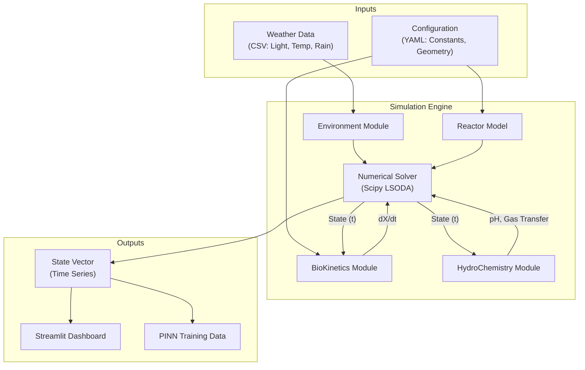
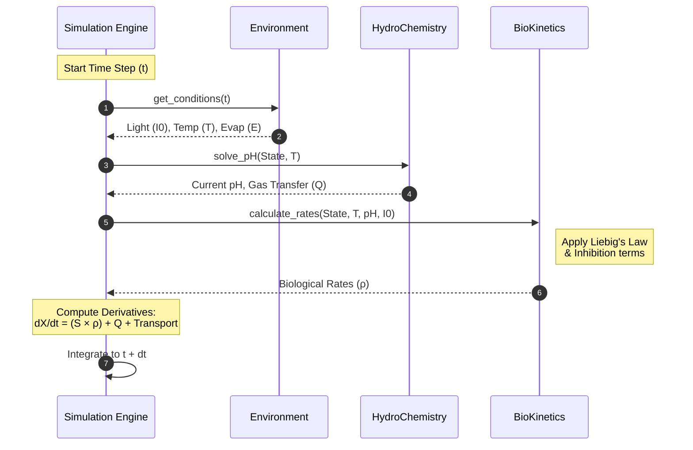

# Architecture Document - BioProcess-Twin Hub

## Table of Contents
1. [High-Level Architecture](#high-level-architecture)
2. [Core Components Design](#core-components-design)
3. [Data Flow](#data-flow)
4. [File Structure](#file-structure)

---

## High-Level Architecture

The system follows a modular pipeline architecture, separating the physical environment, the biological engine, and the numerical solver.



## Core Components Design

### 1. ReactorConfig (`src/core/reactor.py`)
Defines the physical boundaries and operational parameters.
*   **Attributes:** Depth ($h$), Area ($A$), Volume ($V$), Hydraulic Retention Time ($HRT$), Mass Transfer Coefficient ($k_L a$).
*   **Responsibility:** Provides geometry-dependent factors to the solver.

### 2. StateVector (`src/core/state.py`)
Encapsulates the system state at time $t$.
*   **Components:** 17 state variables ($X_{ALG}$, $X_H$, $S_{O2}$, $S_{NH4}$, etc.).
*   **Responsibility:** Central data structure passed between modules to ensure consistency.

### 3. BioKinetics (`src/models/kinetics.py`)
"Biological Brain" of the system. Implements the Petersen Matrix and rate equations.
*   **Key Methods:**
    *   `calculate_rates(state, env_conditions)`: Returns the vector of 19 process rates ($\rho$).
    *   `get_stoichiometry()`: Returns the stoichiometric matrix.
*   **Logic:** Implements Liebig's Law of the Minimum, Monod kinetics, and inhibition terms.

### 4. HydroChemistry (`src/models/chemistry.py`)
"Chemical Brain" of the system. Handles fast algebraic equilibria.
*   **Key Methods:**
    *   `solve_pH(state)`: Uses Newton-Raphson to find $[H^+]$ satisfying charge balance.
    *   `calculate_gas_transfer(state, env_conditions)`: Computes $O_2$, $CO_2$, and $NH_3$ exchange rates based on Henry's Law and diffusivity.
*   **Logic:** Decouples fast chemical reactions from slow biological dynamics.

### 5. Environment (`src/core/environment.py`)
Manages external forcing functions.
*   **Key Methods:**
    *   `get_conditions(t)`: Returns Light ($I_0$), Temperature ($T$), Evaporation ($E$) at time $t$.
    *   `load_weather_data(filepath)`: Parses input CSVs.

### 6. Solver (`src/core/simulation.py`)
Orchestrator of the simulation.
*   **Logic:**
    1.  Initialize $t=0$, State $S_0$.
    2.  Loop until $t_{end}$:
        *   Get environmental conditions for $t$.
        *   Solve algebraic pH constraints.
        *   Compute derivatives $dS/dt = S_{toich} \times \rho + Transport$.
        *   Step forward using `scipy.integrate.solve_ivp`.

## Data Flow

1.  **Initialization:** The `Solver` initializes the `StateVector` and loads `ReactorConfig`.
2.  **Step Calculation:**
    * The Solver gets current conditions ($T, I_0$) from Environment.
    * HydroChemistry solves the algebraic pH system and updates gas transfer rates ($Q_{gas}$).
    * BioKinetics uses the updated state (including pH) to calculate biological rates ($\rho$).
    * Total Derivative = (Stoichiometry $\times$ $\rho$) + (Inflow - Outflow) + $Q_{gas}$.
3.  **Output:** The state history is saved to a `pandas.DataFrame` or `.parquet` file for analysis.



## File Structure

```text
bioprocess-twin-hub/
├── config/
│   ├── reactor_setup.yaml   # Default reactor parameters
│   └── constants.yaml       # Kinetic and stoichiometric constants
├── data/
│   ├── raw/                 # Original weather/influent CSVs
│   └── processed/           # Synthetic data generated
├── docs/                    # Documentation (PRD, Math, Arch)
├── src/
│   ├── core/
│   │   ├── __init__.py
│   │   ├── reactor.py
│   │   ├── state.py
│   │   ├── environment.py
│   │   └── simulation.py
│   ├── models/
│   │   ├── __init__.py
│   │   ├── kinetics.py
│   │   ├── stoichiometry.py
│   │   └── chemistry.py
│   ├── utils/
│   │   └── visualization.py
│   └── main.py              # Entry point
├── tests/                   # Pytest suite
├── pyproject.toml           # uv dependency management
└── README.md
```

---
*Last updated: March 10, 2026 by Anibal Rojo*
