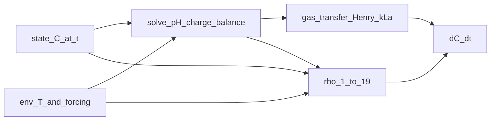

# HydroChemistry in the ALBA Digital Twin

**Pedagogical companion** to the normative model specification in [`MATH_MODEL.md`](MATH_MODEL.md), the supplementary tables [`SI.6`](supporting_informations/SI.6%20Explicit%20chemical%20equilibria%2C%20their%20dissociation%20constants%20with%20temperature%20dependence.md) (aqueous equilibria) and [`SI.7`](supporting_informations/SI.7%20Gas-liquid%20mass%20transfer.md) (gas–liquid transfer), and the architecture sketch in [`ARCHITECTURE.md`](ARCHITECTURE.md). For the **ODE / RHS / time-integration** viewpoint (\(\mathrm{d}\mathbf{C}/\mathrm{d}t = \mathbf{S}^{\mathsf T}\boldsymbol{\rho}\), nested pH, simulators), see [`SIMULATOR_MATH.md`](SIMULATOR_MATH.md).

**Primary literature:** Casagli et al. (2021), *Water Research* 190, 116734 (see [`REFERENCES.md`](REFERENCES.md)).

This document explains, in textbook style, how **biology** (slow accumulation of mass in state variables) couples to **fast aqueous chemistry** (acid–base speciation and electroneutrality) and to **interfacial gas exchange**. It moves from physical meaning to mathematical form to a concise **implementation map**. Numeric parameter tables are **not** duplicated here; use [`MATH_MODEL.md`](MATH_MODEL.md) §1.2.6–1.2.7.

---

## Table of contents

1. [How to read this document](#section-1)
2. [Part A — Idealized reactor and biology as differential equations](#section-2)
3. [Part B — Two descriptions: conservative totals versus species concentrations](#section-3)
4. [Part C — Acid–base reactions and the algebraic speciation layer](#section-4)
5. [Part D — Alkalinity, electroneutrality, and the charge-balance closure](#section-5)
6. [Part E — Temperature: van’t Hoff, Arrhenius-style factors, and Henry correlations](#section-6)
7. [Part F — Gas–liquid transfer (Henry's law, k\_La, volatile species)](#section-7)
8. [Part G — Differential–algebraic structure and nested solvers](#section-8)
9. [Part H — Condensing the theory into code](#section-9)
10. [Part I — Verification, tests, and further reading](#section-10)
11. [Appendix: proton inventory vs SI.6 pH](#section-appendix)

---

## 1. How to read this document

**Audience:** Readers who understand basic calculus and chemistry (moles, concentration, pH) but may not have built bioprocess or water–chemistry models before.

**What you should be able to do after reading:**

- Explain why ALBA carries **total** inorganic carbon $S_{\mathrm{IC}}$ and **total** ammoniacal nitrogen $S_{\mathrm{NH}}$ in the state vector, while **pH** is obtained from an **algebraic** constraint.
- Write the **charge-balance** equation that determines $\mathrm{[H^+]}$ at fixed totals ([SI.6](supporting_informations/SI.6%20Explicit%20chemical%20equilibria%2C%20their%20dissociation%20constants%20with%20temperature%20dependence.md), row 15).
- Interpret **alkalinity** as a buffering / conservative bookkeeping concept linked to strong-acid titration and to unmodeled cations $\Delta \mathrm{CAT_{AN}}$.
- Separate **Arrhenius / $\theta^{T-20}$** scaling (kinetics, $k_La$) from **van’t Hoff** scaling of $K_a$ and from **empirical Henry** formulas in [SI.7](supporting_informations/SI.7%20Gas-liquid%20mass%20transfer.md).
- Map concepts to the intended module [`src/bioprocess_twin/models/chemistry.py`](../src/bioprocess_twin/models/chemistry.py) (see [`ARCHITECTURE.md`](ARCHITECTURE.md)).

---

## 2. Part A — Idealized reactor and biology as differential equations

### 2.1 Control volume and modelling idealizations

Consider a **well-mixed** liquid volume (the raceway pond element in ALBA) exchanging mass with the **atmosphere** at the free surface. The model is **spatially lumped**: concentrations are uniform in space within the control volume, and gradients exist only **across** the air–water interface for the purpose of gas transfer.

Biological processes convert substrates into biomass, gases, and other products on time scales of **hours to days**. Aqueous acid–base reactions are **fast** compared with those processes, so each solute’s **ionic forms** can be treated as being in **instantaneous equilibrium** with one another at the current value of $\mathrm{[H^+]}$.

### 2.2 State variables as inventories

[`MATH_MODEL.md`](MATH_MODEL.md) §2 lists **seventeen** primary state components $\mathbf{C}$. Conceptually:

- **Particulate** variables track organic solids (biomass, slowly biodegradable matter, inerts) often on a **COD** basis.
- **Soluble** variables track dissolved species. Several of these are **analytical totals** over related chemical forms, for example:
  - $S_{\mathrm{IC}}$: **total inorganic carbon** (sum of $\mathrm{CO_2(aq)}$, $\mathrm{HCO_3^-}$, $\mathrm{CO_3^{2-}}$) on a **mass of carbon per volume** basis.
  - $S_{\mathrm{NH}}$: **total ammoniacal nitrogen** ($\mathrm{NH_3}$ plus $\mathrm{NH_4^+}$) on a **mass of nitrogen per volume** basis.
  - $S_{\mathrm{PO4}}$: **total inorganic phosphorus** over all protonation states of phosphate.

The ordinary differential equations (ODEs) describe how these inventories change because of **reaction** and **transport**. In the core ALBA publication, biological reactions are encoded in a **Petersen (stoichiometric) matrix** $\mathbf{S}$ and a vector of **process rates** $\boldsymbol{\rho}$.

### 2.3 The master ODE in words

For the biological block (before adding gas-transfer rows explicitly to the same matrix in code), the dynamics are

$$
\frac{\mathrm{d}\mathbf{C}}{\mathrm{d}t} = \mathbf{S}^\top \boldsymbol{\rho} + \text{(other transport terms if any)}.
$$

Here:

- $\mathbf{C}$ is the state vector (concentrations).
- $\boldsymbol{\rho}$ is a vector of **nonnegative process rates** $\rho_k$ (each has physical dimensions “amount of process $k$ per volume per time”). In [`MATH_MODEL.md`](MATH_MODEL.md) §4, ALBA defines **nineteen** biological rates $\rho_1,\ldots,\rho_{19}$.
- $\mathbf{S}$ is the stoichiometric matrix: entry $S_{k,j}$ gives the stoichiometric coefficient of species $j$ in process $k$. The product $\mathbf{S}^\top \boldsymbol{\rho}$ accumulates, for each species, the net production or consumption from all processes.

Full construction of $\mathbf{S}$ for this repository is documented in [`STOICHIOMETRY.md`](STOICHIOMETRY.md). Closure modes (oxygen, optional proton inventory) change the **width** of $\mathbf{S}$; see [`MATH_MODEL.md`](MATH_MODEL.md) §2.1.

### 2.4 What $\rho_k$ means physically

Each $\rho_k$ is a **rate law**: typically a product of a maximum specific rate, environmental modifiers (temperature, pH, light, dissolved oxygen), and **saturation** terms such as Monod expressions $\frac{S}{K+S}$. **Liebig’s law of the minimum** appears as $\min(\cdot)$ over several nutrients for algal growth.

These laws do **not** depend on how carbonate is split between $\mathrm{HCO_3^-}$ and $\mathrm{CO_2}$; they use **totals** and a small set of soluble species (for example $S_{\mathrm{O2}}$) as written in §4. **However**, gas transfer and some finer mechanisms require knowing the **volatile** fraction ($\mathrm{CO_2}$, $\mathrm{NH_3}$), which **does** depend on pH.

### 2.5 Where gas transfer enters

[`SI.7`](supporting_informations/SI.7%20Gas-liquid%20mass%20transfer.md) introduces additional rates $\rho_{20}$, $\rho_{21}$, $\rho_{22}$ for $\mathrm{O_2}$, $\mathrm{CO_2}$ (as carbon), and $\mathrm{NH_3}$ (as nitrogen). As noted in [`MATH_MODEL.md`](MATH_MODEL.md) §5.2, the **nineteen-row** `get_petersen_matrix()` in this repository is the **biological** block; wiring $\rho_{20}$–$\rho_{22}$ into the same ODE assembly is part of the **hydrochemistry workstream**. Conceptually, once wired,

$$
\frac{\mathrm{d}\mathbf{C}}{\mathrm{d}t} = \mathbf{S}^\top \boldsymbol{\rho}_{\mathrm{extended}},
$$

with $\boldsymbol{\rho}_{\mathrm{extended}}$ including biological and gas-transfer rates, **or** equivalently the gas terms are added to the RHS alongside $\mathbf{S}^\top \boldsymbol{\rho}_{1:19}$. The distinction is bookkeeping; the physics is the same.

---

## 3. Part B — Two descriptions: conservative totals versus species concentrations

### 3.1 Why the modeller tracks totals

Analytical totals are **conserved by stoichiometry** in a clear way. When a process consumes “inorganic carbon,” it reduces $S_{\mathrm{IC}}$ regardless of whether that carbon momentarily appeared as $\mathrm{CO_2}$ or $\mathrm{HCO_3^-}$. Likewise, nitrification consumes **ammoniacal nitrogen** as a total before we care which fraction is $\mathrm{NH_3}$.

Tracking every ionic species as an independent ODE state would require **additional differential equations** for each interconversion. Because interconversions are **fast**, ALBA (like many water-quality models) tracks **totals** in $\mathbf{C}$ and treats speciation as **algebraic**.

### 3.2 Species concentrations from totals and $\mathrm{[H^+]}$

Given a total and a set of $K_a$ values, acid–base equilibrium **partitions** the total among species. Symbolically, for a polyprotic acid family,

$$
C_T = [\mathrm{H_n A}] + [\mathrm{H_{n-1} A^-}] + \cdots + [\mathrm{A^{n-}}],
$$

and each $[\cdot]$ can be written as $C_T$ times a **fraction** $\alpha_i(\mathrm{[H^+]})$ that sums to one:

$$
\alpha_0 + \alpha_1 + \cdots + \alpha_n = 1.
$$

The functional forms are rational functions of $\mathrm{[H^+]}$; §4 derives them for the ALBA sets.

### 3.3 Unit conversion: mass per volume to moles per volume

ALBA state components are often **grams of element per cubic metre** (for example $S_{\mathrm{IC}}$ in $\mathrm{gC\,m^{-3}}$). Speciation formulas in [`SI.6`](supporting_informations/SI.6%20Explicit%20chemical%20equilibria%2C%20their%20dissociation%20constants%20with%20temperature%20dependence.md) use **molar concentrations** in $\mathrm{mol\,m^{-3}}$ for each species in the charge balance.

Examples:

- Total inorganic carbon as moles of carbon per volume:

$$
C_T = \frac{S_{\mathrm{IC}}}{M_{\mathrm{C}}}, \qquad M_{\mathrm{C}} = 12\ \mathrm{g\,mol^{-1}}.
$$

- Total ammoniacal nitrogen as moles of nitrogen per volume:

$$
T_{\mathrm{NH}} = \frac{S_{\mathrm{NH}}}{M_{\mathrm{N}}}, \qquad M_{\mathrm{N}} = 14\ \mathrm{g\,mol^{-1}}.
$$

- Total inorganic phosphorus as moles of phosphorus per volume:

$$
T_{\mathrm{P}} = \frac{S_{\mathrm{PO4}}}{M_{\mathrm{P}}}, \qquad M_{\mathrm{P}} = 31\ \mathrm{g\,mol^{-1}}.
$$

The SI table uses the symbol $S_{\mathrm{NH_3}}$ in one mass-balance row label; in [`MATH_MODEL.md`](MATH_MODEL.md) the same inventory is named $S_{\mathrm{NH}}$. **They denote the same total ammoniacal nitrogen pool.**

### 3.4 Why factors $10^3$ and $10^6$ appear next to $K_a$

Thermodynamic data are often tabulated with concentrations in **mol per litre** (molarity, $\mathrm{M}$). The model works in **mol per cubic metre**. Since $1\ \mathrm{m^3} = 1000\ \mathrm{L}$,

$$
[\cdot]_{\mathrm{mol\,m^{-3}}} = 1000 \times [\cdot]_{\mathrm{M}}.
$$

When $K_a$ is expressed in $\mathrm{M}$ but $\mathrm{[H^+]}$ is in $\mathrm{mol\,m^{-3}}$, ratios must be made dimensionless. SI.6 introduces factors $10^3$ and $10^6$ so that the algebraic forms remain consistent with literature $K_a$ values. **Do not treat these factors as mysterious tuning constants**; they are **unit bridges**.

### 3.5 Fast equilibrium versus slow biology: the DAE picture

**Differential equations** carry $S_{\mathrm{IC}}$, $S_{\mathrm{NH}}$, biomasses, etc. **Algebraic equations** enforce, at each time instant:

- all local $K_a$ relations among species; and
- **electroneutrality** (charge balance), which fixes $\mathrm{[H^+]}$.

Together, the system is a **differential–algebraic equation (DAE)** system. [`ADR 003`](adrs/003-dae-resolution-strategy.md) records the repository decision to use a **nested** algebraic solve for pH inside the ODE right-hand side rather than a fully coupled DAE integrator.

---

## 4. Part C — Acid–base reactions and the algebraic speciation layer

### 4.1 Generic monoprotic acid

For

$$
\mathrm{HA} \rightleftharpoons \mathrm{A^-} + \mathrm{H^+},
$$

the equilibrium expression (ideal dilute solution) is

$$
K_a = \frac{a_{\mathrm{A^-}}\, a_{\mathrm{H^+}}}{a_{\mathrm{HA}}} \approx \frac{[\mathrm{A^-}][\mathrm{H^+}]}{[\mathrm{HA}]},
$$

with activities approximated by molar concentrations for engineering models. The **acid dissociation constant** is often given as $pK_a = -\log_{10} K_a$ in molarity. Reference $pK_a$ values used in ALBA calibration are listed in [`MATH_MODEL.md`](MATH_MODEL.md) §1.2.7.

Given a total analytical concentration $C_T = [\mathrm{HA}] + [\mathrm{A^-}]$, one finds

$$
[\mathrm{A^-}] = C_T\,\frac{K_a}{K_a + [\mathrm{H^+}]}, \qquad [\mathrm{HA}] = C_T\,\frac{[\mathrm{H^+}]}{K_a + [\mathrm{H^+}]},
$$

when all quantities are expressed in **consistent** concentration units.

### 4.2 Ammonium / ammonia

The reaction is written in the SI as

$$
\mathrm{NH_4^+} \rightleftharpoons \mathrm{NH_3} + \mathrm{H^+}.
$$

Let $T_{\mathrm{NH}} = [\mathrm{NH_3}] + [\mathrm{NH_4^+}]$. Then

$$
[\mathrm{NH_3}] = T_{\mathrm{NH}}\,\frac{K_a}{K_a + [\mathrm{H^+}]}, \qquad [\mathrm{NH_4^+}] = T_{\mathrm{NH}}\,\frac{[\mathrm{H^+}]}{K_a + [\mathrm{H^+}]},
$$

with $K_a = K_{a,\mathrm{NH_4}}$. Row 2 of Table SI.6.1 gives the same structure with the SI unit conversions folded into the denominator $1 + K_{a,\mathrm{NH_4}} \cdot 10^3 / \mathrm{H^+}$.

**Physical consequence:** as pH rises ( $\mathrm{[H^+]}$ falls), the **unionized** $\mathrm{NH_3}$ fraction rises — relevant for toxicity and for **volatile ammonia stripping**.

### 4.3 Carbonate system (diprotic, coupled to $\mathrm{CO_2(aq)}$)

The SI writes two steps:

$$
\mathrm{H_2O} + \mathrm{CO_2} \rightleftharpoons \mathrm{HCO_3^-} + \mathrm{H^+}, \qquad K_{a,\mathrm{CO_2}},
$$

$$
\mathrm{HCO_3^-} \rightleftharpoons \mathrm{CO_3^{2-}} + \mathrm{H^+}, \qquad K_{a,\mathrm{HCO_3}}.
$$

Let

$$
C_T = [\mathrm{CO_2}] + [\mathrm{HCO_3^-}] + [\mathrm{CO_3^{2-}}] = \frac{S_{\mathrm{IC}}}{12}
$$

in $\mathrm{mol\,m^{-3}}$. Define

$$
D = [\mathrm{H^+}]^2 + K_1 [\mathrm{H^+}] + K_1 K_2,
$$

with $K_1$ and $K_2$ the **first and second** acidity constants in **consistent** units with $\mathrm{[H^+]}$. Then the fractions are

$$
\alpha_0 = \frac{[\mathrm{H^+}]^2}{D}, \qquad \alpha_1 = \frac{K_1 [\mathrm{H^+}]}{D}, \qquad \alpha_2 = \frac{K_1 K_2}{D},
$$

and $[\mathrm{CO_2}] = C_T \alpha_0$, $[\mathrm{HCO_3^-}] = C_T \alpha_1$, $[\mathrm{CO_3^{2-}}] = C_T \alpha_2$.

Rows 8–9 of Table SI.6.1 are algebraically equivalent closed forms with the SI’s $10^3$ and $10^6$ factors. Equations tagged SI.6.1–SI.6.3 in the SI file illustrate the bicarbonate split explicitly using $\mathrm{H_{ION}^+}$ for the proton activity variable.

**Physical consequence:** **photosynthesis** consumes $\mathrm{CO_2(aq)}$ (and/or shifts carbonate speciation); removing $\mathrm{CO_2}$ from a closed total $C_T$ tends to **raise pH** unless buffered.

### 4.4 Phosphate (triprotic)

Phosphoric acid has three dissociations:

$$
\mathrm{H_3PO_4} \rightleftharpoons \mathrm{H_2PO_4^-} + \mathrm{H^+}, \qquad K_{a,\mathrm{H_3PO_4}},
$$

$$
\mathrm{H_2PO_4^-} \rightleftharpoons \mathrm{HPO_4^{2-}} + \mathrm{H^+}, \qquad K_{a,\mathrm{H_2PO_4}},
$$

$$
\mathrm{HPO_4^{2-}} \rightleftharpoons \mathrm{PO_4^{3-}} + \mathrm{H^+}, \qquad K_{a,\mathrm{HPO_4}}.
$$

With $T_{\mathrm{P}} = [\mathrm{H_3PO_4}] + [\mathrm{H_2PO_4^-}] + [\mathrm{HPO_4^{2-}}] + [\mathrm{PO_4^{3-}}]$, each species concentration is $T_{\mathrm{P}}$ times a rational function of $\mathrm{[H^+]}$. Rows 11–13 of Table SI.6.1 give the implemented fractions.

### 4.5 Nitrite and nitrate (acid pairs)

The SI includes $\mathrm{HNO_2}$/$\mathrm{NO_2^-}$ and $\mathrm{HNO_3}$/$\mathrm{NO_3^-}$ pairs (rows 3–6). At circumneutral pH, nitrite is partly protonated; nitric acid is **very strong** ($pK_a$ strongly negative in [`MATH_MODEL.md`](MATH_MODEL.md) §1.2.7), so $\mathrm{NO_3^-}$ dominates in practice. The algebraic forms remain in the charge balance for completeness.

### 4.6 Water autoionization

$$
\mathrm{H_2O} \rightleftharpoons \mathrm{H^+} + \mathrm{OH^-}, \qquad K_w = [\mathrm{H^+}][\mathrm{OH^-}].
$$

Row 14 of Table SI.6.1 writes $[\mathrm{OH^-}]$ in terms of $K_w$, $\mathrm{[H^+]}$, and the $10^3$ conversion.

---

## 5. Part D — Alkalinity, electroneutrality, and the charge-balance closure

### 5.1 Electroneutrality

Bulk aqueous solutions are **electrically neutral** to exquisite precision. Let $z_i$ be the charge number of species $i$ and $[i]$ its molar concentration. Then

$$
\sum_i z_i [i] = 0.
$$

In natural waters the sum splits into **conservative** ions (strong bases and strong acids fully dissociated) and **carbonate–bicarbonate–borate–…** systems that **shift** with pH.

### 5.2 Operational alkalinity (informal but useful)

**Alkalinity** (total alkalinity in water chemistry) is often defined as **acid neutralizing capacity**: moles of $\mathrm{H^+}$ per kilogram (or per litre) that can be added before reaching a chosen end-point, holding $C_T$ for weak-acid systems fixed during the conceptual titration.

For a carbonate-dominated solution at fixed $C_T$, titrating with strong acid consumes $\mathrm{HCO_3^-}$ and $\mathrm{CO_3^{2-}}$ until $\mathrm{CO_2}$ is the main carbon species. **High alkalinity** means the solution resists pH drop when acid is added (it **buffers** pH).

Alkalinity is **not** a separate ODE in ALBA’s SI.6 formulation; instead, **charge balance plus totals** determines $\mathrm{[H^+]}$. The SI introduces $\Delta \mathrm{CAT_{AN}}$ as a **lumped cationic charge** term (see §5.3).

### 5.3 The SI.6 charge-balance row (closure equation)

Row 15 of Table SI.6.1 states

$$
\mathrm{[H^+]} + [\mathrm{NH_4^+}] + \Delta \mathrm{CAT_{AN}} - [\mathrm{OH^-}] - [\mathrm{NO_2^-}] - [\mathrm{NO_3^-}] - [\mathrm{HCO_3^-}] - 2[\mathrm{CO_3^{2-}}] - [\mathrm{H_2PO_4^-}] - 2[\mathrm{HPO_4^{2-}}] - 3[\mathrm{PO_4^{3-}}] = 0.
$$

Interpretation:

- **Positive terms:** free protons; ammonium; and $\Delta \mathrm{CAT_{AN}}$, representing **net charge from strong cations not written explicitly** (sodium, potassium, calcium, magnesium, …) minus strong anions if not otherwise accounted for, in the lumped convention of the paper.
- **Negative terms:** hydroxide; anionic nitrite and nitrate; bicarbonate and carbonate (note **valence weights** 1 and 2); phosphate species with weights 1, 2, 3.

Every bracketed concentration except $\Delta \mathrm{CAT_{AN}}$ is a **function of $\mathrm{[H^+]}$** and the known totals $S_{\mathrm{IC}}$, $S_{\mathrm{NH}}$, etc. Therefore the charge balance is a **single scalar nonlinear equation** in $\mathrm{[H^+]}$:

$$
F(\mathrm{[H^+]}) = 0.
$$

### 5.4 Why one equation fixes pH

For fixed temperature (hence fixed $K_a$, $K_w$), fixed analytical totals, and fixed $\Delta \mathrm{CAT_{AN}}$, the speciation fractions are uniquely determined by $\mathrm{[H^+]}$. The charge-balance function $F$ is **monotone** in typical natural-water composition ranges, which guarantees a **unique** root — exactly what a Newton iteration can find robustly if bracketed sensibly.

**Repository implementation (Stage 3):** `charge_residual(h_plus, inputs)` assembles SI.6 row 15 from Stage 2 species (`speciate_aqueous`), and `solve_pH(inputs, initial_ph, options)` solves in $\log_{10}[\mathrm{H^+}]$ with bounded fallback if Newton stalls.

### 5.5 Role of $\Delta \mathrm{CAT_{AN}}$ in calibration

If $\Delta \mathrm{CAT_{AN}}$ is wrong, the implied pH is wrong even with perfect biology. In practice, $\Delta \mathrm{CAT_{AN}}$ may be **fitted** from alkalinity measurements or left as a scenario parameter. Documenting its calibration is part of using the twin against data ([`SI.8`](supporting_informations/SI.8%20Sensitivity%20analysis%20and%20calibration%20strategy.md), [`SI.9`](supporting_informations/SI.9%20Parameters%20uncertainty.md) in the supplementary material).

---

## 6. Part E — Temperature: van’t Hoff, Arrhenius-style factors, and Henry correlations

### 6.1 van’t Hoff equation for $K_a(T)$

Equilibrium constants vary with temperature. From thermodynamics,

$$
\frac{\mathrm{d}\ln K}{\mathrm{d}T} = \frac{\Delta H^\circ}{R T^2},
$$

where $\Delta H^\circ$ is the **standard enthalpy change** of the reaction associated with $K$ (endothermic dissociation gives $\Delta H^\circ > 0$), and $R$ is the universal gas constant.

Integrating between a reference temperature $T_{\mathrm{ref}}$ and $T$ yields the form used in SI.6:

$$
\ln\left(\frac{K_{a,T}}{K_{a,T_{\mathrm{ref}}}}\right) = \frac{\Delta H^\circ}{R} \left(\frac{1}{T_{\mathrm{ref}}} - \frac{1}{T_{\mathrm{K}}}\right),
$$

with $T_{\mathrm{K}} = T + 273.15$ for $T$ in °C as written in the SI file (Equation SI.6.4).

**Implementation note:** Each acid–base pair has its own $\Delta H^\circ$ in a full compilation; the repository should source those values consistently with the chosen $K_{a,T_{\mathrm{ref}}}$ baseline.

**Repository conventions (code):** 
- In [`src/bioprocess_twin/models/chemistry.py`](../src/bioprocess_twin/models/chemistry.py), **`T_REF_K = 298.15`** is the Kelvin temperature at which **`default_dissociation_constants_ref_molar()`** defines $K_a$ and $K_w$. Those constants follow **`MATH_MODEL.md`** §1.2.7 ($pK_a$ at **25 °C** → mol·L$^{-1}$) and the usual $K_w \approx 10^{-14}$ at 25 °C. 
- **`ka_at_T` / `scale_dissociation_constants_at_t`** use Equation SI.6.4 with that same $T_{\mathrm{ref}}$, so $K_{a,T_{\mathrm{ref}}}$ and the tabulated $\Delta H^\circ$ baseline (**298.15 K**, infinite dilution, 1 bar — see the note below) are **aligned**. 
- Table SI.6.1 in the repo marks some numeric $K_A$ at **293 K**; those are the paper’s rounded values at ~20 °C and may differ slightly from the MATH_MODEL $pK_a$ pack — the **implementation SSOT** for $K_{a,\mathrm{ref}}$ in code is §1.2.7 at **298.15 K**, not the SI column in isolation.

**Repository note:** 
- Default standard reaction enthalpies $\Delta H^\circ$ (infinite dilution, **298.15 K**, 1 bar), their literature/database lineage, and reaction definitions are summarized in [`notes/aqueous-acid-base-reaction-enthalpies.md`](notes/aqueous-acid-base-reaction-enthalpies.md). 
- The same numbers are exposed via **`default_dissociation_enthalpy_j_per_mol()`** in [`chemistry.py`](../src/bioprocess_twin/models/chemistry.py).

### 6.2 Arrhenius law and the $\theta^{T-20}$ shorthand

The **Arrhenius** form for a rate constant is

$$
k(T) = A \exp\left(-\frac{E_a}{R T}\right).
$$

Over narrow temperature bands, modellers often use a **linearized** correction about a reference $T_0$:

$$
k(T) \approx k(T_0)\, \theta^{(T - T_0)}.
$$

In ALBA, **decay** modifiers use $\theta^{(T-20)}$ with process-specific $\theta$ ([`MATH_MODEL.md`](MATH_MODEL.md) §1.2.3, §3.1). **Gas-transfer** scaling likewise applies $\theta^{T-20}$ to $k_La$ ([`SI.7`](supporting_informations/SI.7%20Gas-liquid%20mass%20transfer.md), Table SI.7.1).

**Physical direction:** higher $T$ typically **increases** biological rates and **increases** $k_La$ in this parameterization.

### 6.3 Distinct from Henry’s temperature dependence

[`SI.7`](supporting_informations/SI.7%20Gas-liquid%20mass%20transfer.md) states explicitly that **Henry’s constants** move in the **opposite** direction to $k_La$ scaling: **lower** temperature increases **solubility** (larger dissolved concentration at a given gas-phase partial pressure) in the empirical $H(T)$ correlations SI.7.3–SI.7.5 attributed to Sander (2015).

**Do not** confuse:

- $\theta^{T-20}$ multiplying $k_La$ (kinetic / transport coefficient), and
- $H_{\mathrm{O_2}}(T)$, $H_{\mathrm{CO_2}}(T)$, $H_{\mathrm{NH_3}}(T)$ (thermodynamic solubility packaging).

Both depend on $T$; they enter **different places** in SI.7.2.

### 6.4 Cardinal temperature for growth ($f_T$)

Biological **growth** uses the **Cardinal Temperature Model with Inflection (CTMI)** $f_T$ in [`MATH_MODEL.md`](MATH_MODEL.md) §3.1 — a **non-Arrhenius** shape with $T_{\min}, T_{\mathrm{opt}}, T_{\max}$. This is unrelated to $K_a(T)$; keeping the layers separate avoids mixing “physiology” with “thermodynamic equilibrium.”

---

## 7. Part F — Gas–liquid transfer (Henry's law, k\_La, volatile species)

### 7.1 Two-film intuition

Near the interface, mass transfer is often limited by **diffusion through a thin liquid film**. The **volumetric** transfer coefficient $k_La$ (units $\mathrm{s^{-1}}$ or $\mathrm{d^{-1}}$ after time scaling) packs film thickness and interfacial area per volume into one measurable quantity.

Different gases have different molecular diffusivities $D_{S_j}$ in water. [`SI.7`](supporting_informations/SI.7%20Gas-liquid%20mass%20transfer.md) scales each $k_La_j$ relative to oxygen using

$$
\frac{k_La_j}{k_La_{\mathrm{O_2}}} = \left(\frac{D_{S_j}}{D_{\mathrm{O_2}}}\right)^{0.5} \tag{SI.7.1}
$$

(Sperandio-type correlation).

### 7.2 Driving force: Henry’s law in the SI packaging

The SI writes the transfer rate as

$$
Q_j = k_La_{\mathrm{O_2}} \left(\frac{D_{S_j}}{D_{\mathrm{O_2}}}\right)^{0.5} \left(H_{S_j}(T)\, p_{S_j} - S_j\right) \tag{SI.7.2}
$$

with $H_{S_j}$ in **liquid-phase concentration per partial pressure** units consistent with [`MATH_MODEL.md`](MATH_MODEL.md) §1.2.6. Here $S_j$ must be the **dissolved species that participates in Henry equilibrium** for that gas:

- $\mathrm{O_2}$: $S_{\mathrm{O_2}}$.
- $\mathrm{CO_2}$: **free** $\mathrm{CO_2(aq)}$, not total $S_{\mathrm{IC}}$.
- $\mathrm{NH_3}$: **unionized** ammonia, not total $S_{\mathrm{NH}}$.

The SI text emphasizes this distinction immediately below SI.7.2.

### 7.3 Driving force, saturation, and direction of transfer

**Equilibrium (Henry) concentration in the liquid.** For a dilute species $j$ in equilibrium with a gas phase at partial pressure $p_{S_j}$, the SI packs solubility into $H_{S_j}(T)$ so that the **liquid-side concentration in equilibrium with the gas** is

$$
C_j^* = H_{S_j}(T)\, p_{S_j}.
$$

**Liquid-side concentration that enters the flux.** Let $C_j^{\mathrm{liq}}$ denote the **actual** dissolved concentration of the **same chemical form** that Henry’s law uses for species $j$ (§7.2): $S_{\mathrm{O_2}}$ for oxygen; volatile $\mathrm{CO_2(aq)}$ for carbon dioxide; unionized $\mathrm{NH_3}$ for ammonia.

**Linear driving force.** The bracket in SI.7.2 is the **thermodynamic driving force** (units consistent with $Q_j$ and $H$):

$$
\Delta_j = C_j^* - C_j^{\mathrm{liq}}.
$$

With a **positive** overall kinetic prefactor $K_j > 0$ (volumetric transfer coefficient in the SI sense: $k_La_{\mathrm{O_2}}$, diffusivity ratio, and, in Table SI.7.1, the factor $\theta^{T-20}$), the model writes

$$
Q_j = K_j\, \Delta_j.
$$

**Physical interpretation of the sign of $Q_j$** (convention as in Casagli et al.: $Q_j$ is a **volumetric rate** added to the liquid balance for that component):

- If $\Delta_j > 0$ ($C_j^{\mathrm{liq}} < C_j^*$): the liquid is **undersaturated** relative to the atmosphere → **net dissolution / reaeration** → $Q_j > 0$ tends to **raise** $C_j^{\mathrm{liq}}$ over time (other processes permitting).
- If $\Delta_j < 0$ ($C_j^{\mathrm{liq}} > C_j^*$): the liquid is **supersaturated** relative to the gas phase → **net volatilization / stripping** → $Q_j < 0$ tends to **lower** $C_j^{\mathrm{liq}}$.

The gas transfer it's not implemented as 'enters' or 'escapes': **one** expression fixes the direction from the sign of $\Delta_j$.

**Oxygen and diel (day–night) cycles.** During **daytime**, strong **photosynthesis** can raise $S_{\mathrm{O_2}}$ until the liquid approaches or exceeds air equilibrium ($C_{\mathrm{O_2}}^*$), so $\Delta_{\mathrm{O_2}}$ may become **negative** and **loss** of $\mathrm{O_2}$ to the atmosphere can dominate interfacial exchange. During **night**, photosynthesis drops while **respiration** continues; if consumption outpaces reaeration, $S_{\mathrm{O_2}}$ can fall **below** $C_{\mathrm{O_2}}^*$, $\Delta_{\mathrm{O_2}} > 0$, and **net uptake** of $\mathrm{O_2}$ from the air is expected. The actual trajectory depends on biomass, light, temperature, $k_La$, and the full RHS—not on a fixed rule “$\mathrm{O_2}$ always leaves.”

**Carbon dioxide.** $\mathrm{CO_2}$ can **enter** the liquid when biology or chemistry keeps free $\mathrm{CO_2(aq)}$ **below** $C_{\mathrm{CO_2}}^*$ (e.g. rapid daytime carbon fixation shifting carbonate speciation). It can **leave** when the volatile dissolved form is **above** equilibrium. Again the sign follows $\Delta_{\mathrm{CO_2}}$, not “$\mathrm{CO_2}$ always strips.”

**Ammonia.** The same structure applies with $C^{\mathrm{liq}}$ as unionized $\mathrm{NH_3}$ and $p_{\mathrm{NH_3}}$ typically small in ambient air; high pH increases the volatile fraction from $S_{\mathrm{NH}}$, which often pushes toward **stripping**, but the **direction** is still set by $\Delta_{\mathrm{NH_3}}$.

**Nitrogen gas ($\mathrm{N_2}$).** The published SI.7 excerpt in this repository documents $\rho_{20}$–$\rho_{22}$ for $\mathrm{O_2}$, $\mathrm{CO_2}$, and $\mathrm{NH_3}$ only. The ALBA state vector includes $S_{\mathrm{N_2}}$ ([`MATH_MODEL.md`](MATH_MODEL.md) §2); **if** interfacial $\mathrm{N_2}$ exchange is implemented analogously, the same driving-force logic applies with $p_{\mathrm{N_2}}$ near $0.78\ \mathrm{atm}$ in air—**either** uptake or release depending on whether $S_{\mathrm{N_2}}$ is below or above the corresponding $C_{\mathrm{N_2}}^*$. That process is **not** part of Table SI.7.1 as transcribed here until explicitly implemented.

### 7.4 Implemented process rates $\rho_{20}$–$\rho_{22}$

Table SI.7.1 collects the model’s gas-transfer rates (with $\theta^{T-20}$, diffusivity scaling, Henry terms, and **volatile fractions** expressed using $\mathrm{H_{ION}^+}$ and $K_a$ combinations). The $\mathrm{CO_2}$ and $\mathrm{NH_3}$ rows use shorthand fractions:

$$
\frac{S_{\mathrm{IC}}}{1 + \frac{K_{a,\mathrm{CO_2}} \cdot 10^3}{\mathrm{H_{ION}^+}}}, \qquad \frac{S_{\mathrm{NH}}}{1 + \frac{K_{a,\mathrm{NH_3}} \cdot 10^3}{\mathrm{H_{ION}^+}}},
$$

in the SI file’s notation (subscripts follow the table; align $K_a$ convention with SI.6 for ammonium).

**Implementation consistency:** Driving-force concentrations must use the **same** unit system as SI.6 speciation. If a shorthand in Table SI.7.1 is ambiguous, the **full** $\mathrm{CO_2}$ expression from SI.6 row 8 is the authoritative volatile $\mathrm{CO_2}$ concentration from $S_{\mathrm{IC}}$ and $\mathrm{[H^+]}$.

### 7.5 Empirical $H(T)$ formulas

Equations SI.7.3–SI.7.5 give $H_{\mathrm{O_2}}(T)$, $H_{\mathrm{CO_2}}(T)$, and $H_{\mathrm{NH_3}}(T)$ as exponentials in $(1/T_{\mathrm{K}} - 1/T_{\mathrm{ref,K}})$. These are **paper-chosen** correlations; implement them **exactly** when reproducing Casagli et al. (2021).

---

## 8. Part G — Differential–algebraic structure and nested solvers

### 8.1 Formal split

**Differential states** $\mathbf{C}(t)$ evolve according to production/consumption and transport.

**Algebraic constraint:** at each $(\mathbf{C}, T, \ldots)$,

$$
F(\mathrm{[H^+]}; \mathbf{C}) = 0,
$$

the charge-balance equation with speciation substituted.

This is the classic **DAE** structure: differential variables plus an algebraic relation that must hold at all times.

### 8.2 Nested solver (ADR 003)

[`ADR 003`](adrs/003-dae-resolution-strategy.md) records the decision to:

1. Advance $\mathbf{C}$ with a standard ODE method (for example `scipy.integrate.solve_ivp`).
2. Whenever the ODE right-hand side needs $\mathrm{[H^+]}$, call a **root finder** (Newton–Raphson or `scipy.optimize.root`) on $F(\mathrm{[H^+]})$.

**Pros:** reuse mature ODE integrators; isolate stiff chemistry from biology conceptually.

**Cons:** extra root-finding work **per RHS evaluation**; care needed for smoothness and initial guesses when $\mathbf{C}$ changes rapidly.

Current chemistry module policy uses Newton on $\log_{10}[\mathrm{H^+}]$ with pH bounds and a bracketed fallback path, returning convergence metadata (iterations, method used, residual).

### 8.3 Information flow (architecture-level)

The following flow matches [`ARCHITECTURE.md`](ARCHITECTURE.md): environment forcing, biological rates, and hydrochemistry feed the assembled $\mathrm{d}\mathbf{C}/\mathrm{d}t$.

---

## 9. Part H — Condensing the theory into code

### 9.1 Module boundary

[`ARCHITECTURE.md`](ARCHITECTURE.md) assigns:

- **`solve_pH(state)`** — given $\mathbf{C}$ and $T$, return $\mathrm{[H^+]}$ (or pH) satisfying SI.6 row 15.
- **`calculate_gas_transfer(state, env_conditions, h_plus_mol_m3, theta_kla=..., gas_conditions=...)`** in [`gas_transfer.py`](../src/bioprocess_twin/models/gas_transfer.py) — returns $\rho_{20}$–$\rho_{22}$ aligned with Table SI.7.1. Pass **`h_plus_mol_m3`** from `solve_pH` (nested DAE, ADR 003).

**Stage 5 implementation (low-level API):** [`hydrochemistry_api.py`](../src/bioprocess_twin/models/hydrochemistry_api.py) exposes **`solve_pH_from_state`**, **`hydrochemistry_step`** (pH then gas in one call), and **`speciation_totals_from_state`**. SI.6 pH uses **`env.temperature_C`** only; **`EnvConditions.pH`** is not read in the pH / gas sub-call. By contrast, biological **`calculate_rates`** reads **`EnvConditions.pH`** for cardinal pH modifiers. If you call **`hydrochemistry_step`**, **`solve_pH_from_state`**, and **`calculate_rates`** manually in sequence, you must set **`env.pH`** to the **solved** pH (or to an explicit policy) before **`calculate_rates`** if you want that step’s kinetics to use the same pH as SI.6. Unit tests and examples document this when building **`EnvConditions`** (for example, [`test_hydrochemistry_api`](../tests/unit/test_hydrochemistry_api.py) around **`compute_rates` → `pH=result.pH` → `calculate_rates`**).

**Stage 6 implementation (unified liquid RHS):** The simulator’s **`evaluate_liquid_rhs`** in [`liquid_rhs.py`](../src/bioprocess_twin/simulator/liquid_rhs.py) (see [`SIMULATOR_MATH.md` §Appendix F.1](SIMULATOR_MATH.md#sim-appendix-f-impl)) does this alignment for you: after **`hydrochemistry_step`**, it rebuilds **`EnvConditions`** with **`pH` equal to the solved SI.6 pH** and passes that to **`calculate_gas_transfer`** and **`calculate_rates`**, so cardinal kinetics, Henry/volatiles, and the assembled **22-process** right-hand side are self-consistent in one call. Diel time-varying $T$ and irradiance, transport, and a full ODE/DAE time loop are still the domain of the broader orchestration (for example **Sprint 4** and beyond); Stage 6 locks the **per-RHS pH** contract.

**Temperature conventions in code:** **`T_REF_CELSIUS_KLA = 20`** °C for $\theta^{T-20}$ scaling of **`k_L a`** (SI.7 / Ginot & Hervé style). **Henry SI.7.3–7.5** and $K_{a,\mathrm{ref}}$ use the **298.15 K** anchor (25 °C thermodynamic SSOT; see `chemistry.T_REF_K` and module docstring in `gas_transfer.py`). Do not conflate these two references.

### 9.2 Internal functions

| Concern | Function | Notes |
|--------|--------------------|-------|
| $K_a(T)$, $K_w(T)$ | `scale_dissociation_constants_at_t(ref, dh, T_celsius)` | van’t Hoff from $K_{a,\mathrm{ref}}$ at **298.15 K** (`T_REF_K`) and `AlbaDissociationEnthalpy`. |
| Totals → mol $\text{m}^{-3}$ | `totals_to_molar(...)` | $S_{\mathrm{IC}}/12$, $S_{\mathrm{NH}}/14$, etc. |
| Speciation | `speciate(h_plus, totals, constants)` | Implement Table SI.6.1 rows 2, 4, 6, 8–9, 11–13, 14. |
| Charge residual | `charge_residual(h_plus, inputs)` | SI.6 row 15 including $\Delta \mathrm{CAT_{AN}}$ as a parameter or state field. |
| Root find | `solve_pH(inputs, initial_ph, options)` | Newton in $\log_{10}\mathrm{[H^+]}$ with bounded fallback for robustness. |
| Henry | `henry_o2_co2_nh3(T_celsius)` | SI.7.3–SI.7.5 (`HenryConstantsGas`). |
| $k_La$ scale | `kinetic_kla_factor`, `effective_kla_o2_per_day`, `diffusivity_ratio_sqrt_co2` / `_nh3` | $\theta^{T-20}$ ref. **20 °C**; $(D_j/D_{\mathrm{O_2}})^{1/2}$ from MATH_MODEL §1.2.6. |
| Volatile fractions | `liquid_volatile_co2_gC_per_m3`, `liquid_volatile_nh3_gN_per_m3` | SI.6.1 rows 8–9 and 2 (full carbonate / ammonia speciation). |
| Rates | `calculate_gas_transfer` | Table SI.7.1; optional `GasTransferConditions` (defaults from §1.2.6). |
| **Stage 6** liquid RHS (orchestrator) | **`evaluate_liquid_rhs`** in [`liquid_rhs.py`](../src/bioprocess_twin/simulator/liquid_rhs.py) | **One call:** `hydrochemistry_step` (pH + gas) → rebuild **`EnvConditions`** with **`pH` = solved SI.6 pH** → `calculate_rates` and assembly of **dC/dt** from the full 22×17 layout (stoichiometry × rates). Returns derivatives and diagnostics; **not** a time integrator. **§9.1** Stage 6, [`SIMULATOR_MATH.md` §F.1](SIMULATOR_MATH.md#sim-appendix-f-impl). |

### 9.3 Units checklist

- **Mass concentrations:** $\mathrm{g\,m^{-3}}$ for $S_{\mathrm{IC}}$ (as carbon), $S_{\mathrm{NH}}$ (as nitrogen), $S_{\mathrm{O_2}}$, etc., per [`MATH_MODEL.md`](MATH_MODEL.md) §2.
- **Molar species** in SI.6 charge balance: $\mathrm{mol\,m^{-3}}$.
- **Partial pressures:** atm in SI.7 as written.
- **Time:** SI.7.1 uses $\mathrm{d^{-1}}$ for rates after converting $k_La$ if reference values are per second.

### 9.4 Derivatives for Newton (optional but efficient)

Analytic derivative $\mathrm{d}F/\mathrm{d}\mathrm{[H^+]}$ improves convergence (target: **fewer than ten iterations** in normal ranges). If deriving by hand is tedious, use **automatic differentiation** or a validated finite-difference derivative with careful scaling.

---

## 10. Part I — Verification, tests, and further reading

### 10.1 Unit tests (conceptual checklist)

- **Speciation:** at fixed totals and $T$, check that mass balances (sums of species) recover $C_T$, $T_{\mathrm{NH}}$, $T_{\mathrm{P}}$.
- **Charge balance:** $|F(\mathrm{[H^+]})|$ near machine precision at the solved root.
- **Newton behaviour:** iteration count and convergence from diverse initial guesses.
- **Temperature:** vary $T$; $K_a(T)$ from van’t Hoff should move pH and $\mathrm{NH_3}$ fraction in physically expected directions.
- **Henry / $k_La$:** compare $Q_j$ to hand calculations from SI.7.2 for a few tabulated points.
- **Regression:** optional snapshot tests once reference outputs exist.

See [`docs/development/TESTING.md`](development/TESTING.md) for project test commands.

### 10.2 Literature

- **ALBA:** Casagli et al. (2021) — [`REFERENCES.md`](REFERENCES.md).

---

## Appendix: proton inventory vs SI.6 pH

[`MATH_MODEL.md`](MATH_MODEL.md) §2.1 and [ADR 007](adrs/007-elemental-mass-balance-oh-closure.md) describe an optional **eighteenth** state component $S_{H\_PROTON}$ (units $\mathrm{g\,H\,m^{-3}}$) used for **elemental hydrogen bookkeeping** on biological Petersen rows when closing O and H with a dedicated proton column.

| Aspect | $S_{H\_PROTON}$ closure ([`proton_closure_rationale.md`](mass_balances/guides/proton_closure_rationale.md)) | SI.6 pH sub-model |
|--------|-----------------------------------|-------------------|
| Purpose | Close **elemental H** mass balance audits for stoichiometry | Predict **pH** and aqueous speciation from **charge** + equilibria |
| Coupled to $K_a$? | No | Yes |
| Enforces electroneutrality? | No | Yes (row 15) |
| Typical ODE | May appear when simulating extended layout | **Not** a separate proton ODE; $\mathrm{[H^+]}$ from algebraic solve |

**Do not equate** these layers. A future **fully coupled** twin might link them through additional process rows; the present documentation keeps the distinction explicit.

---

*This file is descriptive engineering documentation. For binding numeric defaults and matrix scope, always defer to [`MATH_MODEL.md`](MATH_MODEL.md) and the cited SI files.*
