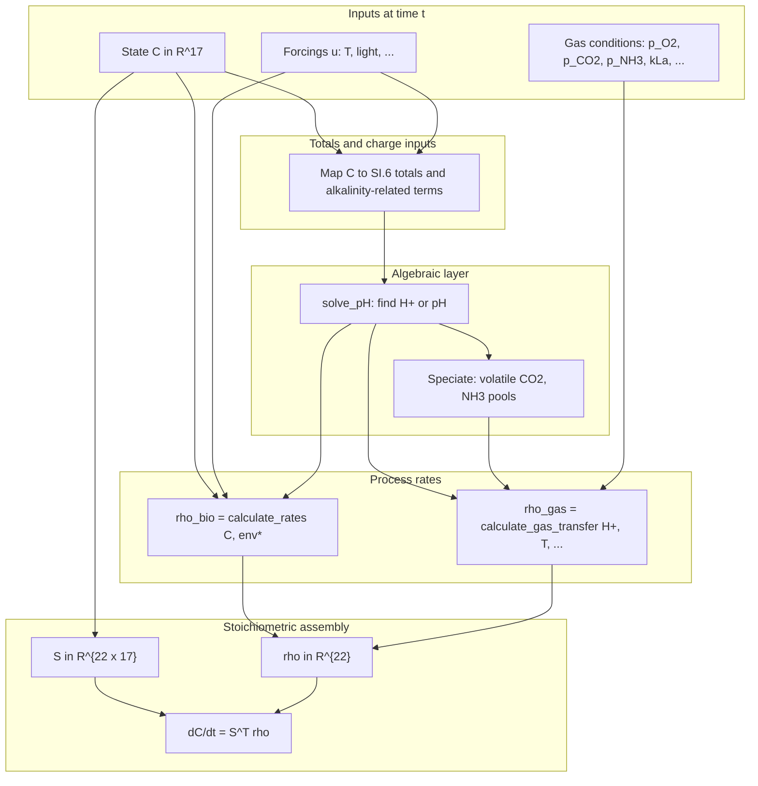
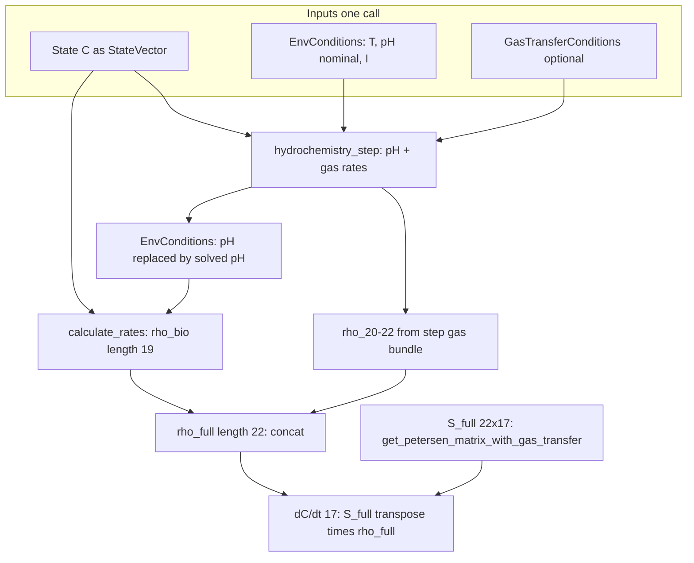

# Mathematics of the ALBA Simulator: Dynamics, the RHS, and the Path to Time Integration

This document explains, in **textbook depth**, the **ordinary differential equation (ODE)** structure of the digital twin, the meaning of the **right-hand side (RHS)**, how the **Petersen stoichiometric matrix** $\mathbf{S}$ and the **process rate vector** $\boldsymbol{\rho}$ assemble that RHS, and how **fast aqueous chemistry** and **gas–liquid transfer** enter as a **nested algebraic layer** inside the same mathematical object. It is **not** a duplicate of numeric parameter tables: for symbols, values, and equation tags, defer to [`MATH_MODEL.md`](MATH_MODEL.md) and the SI excerpts.

**Primary literature:** Casagli et al. (2021), *Water Research* 190, 116734 (see [`REFERENCES.md`](REFERENCES.md)).

---

## Table of contents

1. [How to read this document](#sim-1-how-to-read)
2. [Part A — Control volume, state, and modelling idealizations](#sim-2-part-a)
3. [Part B — Ordinary differential equations, the RHS, and the vector field](#sim-3-part-b)
4. [Part C — The Petersen structure: $\mathbf{S}$, $\boldsymbol{\rho}$, and $\mathbf{S}^{\mathsf T}\boldsymbol{\rho}$](#sim-4-part-c)
5. [Part D — Process rates: biological kinetics versus gas–liquid fluxes](#sim-5-part-d)
6. [Part E — Algebraic coupling: speciation, pH, and composition of maps](#sim-6-part-e)
7. [Part F — From the RHS to a numerical trajectory](#sim-7-part-f)
8. [Part G — Scope boundaries and related literature](#sim-8-part-g)
9. [Appendix A — Notation and dimensional analysis](#sim-appendix-a)
10. [Appendix B — Glossary (English terms used in code and papers)](#sim-appendix-b)
11. [Appendix C — Concept-to-module map (mathematics $\rightarrow$ repository)](#sim-appendix-c)
12. [Appendix D — Worked micro-examples: oxygen, inorganic carbon, ammonium](#sim-appendix-d)
13. [Appendix E — Extended remarks: positivity, invariants, and sensitivity](#sim-appendix-e)
14. [Appendix F — RHS evaluation flow (reference diagram)](#sim-appendix-f)
15. [Appendix F.1 — Stage 6 implementation in `liquid_rhs.py`](#sim-appendix-f-impl)

---

## 1. How to read this document

### 1.1 Audience and prerequisites

**Audience:** Readers comfortable with **linear algebra** (matrix–vector products, transposes), **multivariate calculus** (partial derivatives, the chain rule), and **basic chemical kinetics** (reaction rates, stoichiometric coefficients). Prior exposure to **activated sludge models** (ASM) or **Petersen matrices** is helpful but not required: the narrative builds those objects from first principles.

**Prerequisites:**

- Comfort reading $\mathbf{x} \in \mathbb{R}^n$, $\mathbf{A} \in \mathbb{R}^{m \times n}$, and $\mathbf{A}^{\mathsf T}$ (transpose).
- Understanding that a **model** is a **map** from assumptions and data to predictions; here the central map is **time integration** of a **dynamical system**.

### 1.2 Learning objectives

After studying this document, you should be able to:

- State the **ODE initial-value problem** that defines the twin’s core dynamics and identify **LHS** versus **RHS**.
- Explain why ALBA writes $\mathrm{d}\mathbf{C}/\mathrm{d}t = \mathbf{S}^{\mathsf T}\boldsymbol{\rho}$ and what each symbol **means physically and dimensionally**.
- Relate the **19 biological processes** and the **three gas–liquid processes** $\rho_{20}$–$\rho_{22}$ to the **22-row** layout of Table SI.3.1 (including the “Equilibrium phase” rows).
- Describe, at a **systems level**, how **pH** enters as the solution of an **algebraic** subproblem **nested inside** each evaluation of the RHS.
- Recognize why numerical integration raises separate questions (**stiffness**, **operator splitting**, **implicit versus explicit methods**) from the **continuous-time** definition of the model.

### 1.3 Relationship to other project documents

| Document | Role relative to this one |
|----------|---------------------------|
| [`MATH_MODEL.md`](MATH_MODEL.md) | **Normative SSOT:** numbered equations, parameters, SI alignment. |
| [`HYDROCHEMISTRY.md`](HYDROCHEMISTRY.md) | **Chemistry:** totals vs species, charge balance, Henry, SI.6–SI.7 narrative. |
| [`STOICHIOMETRY.md`](STOICHIOMETRY.md) | **Matrix construction** and mass-balance audit of $\mathbf{S}$. |
| [`ARCHITECTURE.md`](ARCHITECTURE.md) | **Software boundaries** between modules that realize the mathematics. |
| **This document** | **Dynamics:** ODEs, RHS, $\mathbf{S}^{\mathsf T}\boldsymbol{\rho}$, integration viewpoint. |

---

## 2. Part A — Control volume, state, and modelling idealizations

### 2.1 The control volume and the well-mixed hypothesis

Consider a **liquid control volume** $\mathcal{V}$ representing an element of a raceway pond (ALBA). The **well-mixed** (spatially **lumped**) hypothesis asserts that intensive quantities (especially the **concentrations** that constitute the state vector) are **uniform** throughout $\mathcal{V}$ at each instant $t$. Spatial gradients **within** the pond are neglected; gradients **across** the air–water interface are retained only insofar as they drive **interfacial fluxes** parameterized by $k_La$ and **Henry’s law** (see [`SI.7`](supporting_informations/SI.7%20Gas-liquid%20mass%20transfer.md)).

**Consequence:** the model is a **finite-dimensional** dynamical system: the state is a vector $\mathbf{C}(t) \in \mathbb{R}^n$ with $n$ fixed, not a field $c(\mathbf{x},t)$ governed by partial differential equations (PDEs). A **distributed** extension (hydraulics, velocity profiles, light attenuation with depth) would change the mathematical class of the model entirely; this document stays in the **lumped** framework consistent with Casagli et al. (2021) as implemented in this repository.

### 2.2 State variables as inventories per unit volume

Let $\mathbf{C}(t) = (C_1,\ldots,C_n)^{\mathsf T}$. In ALBA’s primary layout, $n = 17$. Each $C_j$ is an **inventory density**: mass of a **defined chemical or biological pool** per **liquid volume**, with units declared in [`MATH_MODEL.md`](MATH_MODEL.md) §2 and mirrored in [`StateVector`](../src/bioprocess_twin/core/state.py).

**Particulate** components (e.g. biomass $X_{\mathrm{ALG}}$, $X_H$, …) are typically expressed on a **COD** (chemical oxygen demand) basis for organic solids. **Soluble** components mix **COD-based** organics ($S_S$, $S_I$) with **elemental totals** for inorganic pools (e.g. $S_{\mathrm{IC}}$ as **total inorganic carbon** in $\mathrm{g\,C\,m^{-3}}$, $S_{\mathrm{NH}}$ as **total ammoniacal nitrogen** in $\mathrm{g\,N\,m^{-3}}$). This hybrid bookkeeping is standard in bioprocess modelling: **slow** transformations update totals; **fast** acid–base equilibria **partition** totals among species **algebraically** (see [`HYDROCHEMISTRY.md`](HYDROCHEMISTRY.md) Part B).

### 2.3 The state space and admissible sets

Mathematically, one may regard $\mathbf{C}(t)$ as evolving in $\mathbb{R}^n$. **Chemically admissible** states lie in the **nonnegative orthant**

$$
\mathbb{R}^n_{\ge 0} = \{\mathbf{C} \in \mathbb{R}^n : C_j \ge 0 \ \forall j\},
$$

because negative concentrations are not physical for these inventory variables. **Theorems** about existence and uniqueness of solutions are often stated for **open** sets in $\mathbb{R}^n$; practical bioprocess models use **rate laws** that extend smoothly to a neighborhood of the orthant (with **numerical safeguards** such as clipping in code). Appendix E returns to **positivity**.

### 2.4 Forcing variables and parameters

Not everything that influences the pond is a **state component**. **Environmental inputs** (temperature, incident photosynthetic radiation, partial pressures in the gas phase, volumetric mass-transfer coefficient $k_La$, etc.) may be treated as **prescribed functions of time** $\mathbf{u}(t)$ or as **parameters** $\mathbf{p}$ held fixed over an interval. In code, both may appear as arguments to the same RHS callable; the split below is about **modelling intent**, not a different equation structure.

#### Calibration

Suppose observations are available as $(t,\, \mathbf{C}^{\mathrm{obs}}(t),\, \mathbf{u}^{\mathrm{obs}}(t))$ on a calibration window—measured (or reconstructed) state trajectories and measured forcings. **Calibration** seeks parameters $\mathbf{p}$ (kinetic maxima, half-saturations, yields, fixed $k_La$ references, etc.) such that the model trajectory $\mathbf{C}(t;\, \mathbf{p})$ driven by the **same** prescribed $\mathbf{u}^{\mathrm{obs}}(t)$ **matches** $\mathbf{C}^{\mathrm{obs}}(t)$ in a chosen metric (nonlinear least squares, likelihood / Bayesian posterior, …). Across **outer** optimisation iterations, $\mathbf{p}$ changes; **within** each forward simulation, $\mathbf{p}$ is typically **held constant** while $\mathbf{u}(t)$ follows the data record.

#### Scenario analysis

Once $\mathbf{p}$ is **fixed** (an “accepted” model), **scenario analysis** varies **$\mathbf{u}(t)$** and/or **initial conditions** $\mathbf{C}(t_0)$ to answer operational or climate questions: e.g. “what if winter were 5 °C colder on average?”, “what if mean irradiance doubled?”, “what if paddle-wheel policy changed the effective $k_La(t)$ schedule?”. The object of study is the **response** of $\mathbf{C}(t)$ to **alternative worlds or policies**, not a further update of the kinetic parameter vector.

Keeping the two activities separate avoids conflating **fitting the model to a pilot trace** with **exploring counterfactual forcings**; the same symbol $\mathbf{u}(t)$ may appear in both workflows, but the **question** (tune $\mathbf{p}$ vs perturb $\mathbf{u}$) differs.

We will write the RHS in the **general** form $\mathbf{f}(\mathbf{C}, t, \mathbf{u})$. When $\mathbf{f}$ does not depend explicitly on $t$ except through $\mathbf{u}$, the system is still **non-autonomous** if $\mathbf{u}$ varies with time. **Autonomous** systems $\mathrm{d}\mathbf{C}/\mathrm{d}t = \mathbf{g}(\mathbf{C})$ are a special case with $\mathbf{u}$ constant or folded into $\mathbf{g}$.

### 2.5 Column order of $\mathbf{C}$ in the Casagli SI layout

The **Petersen matrix columns** and the **flat array** produced by `StateVector.to_array(variant=SI)` share the same ordering $j=0,\ldots,16$. The table below links **index** $j$, **symbol** (pool), and **typical primary unit** as used in this repository (see [`MATH_MODEL.md`](MATH_MODEL.md) §2 and [`state.py`](../src/bioprocess_twin/core/state.py)).

| $j$ | Symbol | Role / unit (short) |
|------:|--------|---------------------|
| 0 | $X_{\mathrm{ALG}}$ | Algal biomass, $\mathrm{gCOD\,m^{-3}}$ |
| 1 | $X_{\mathrm{AOB}}$ | AOB biomass, $\mathrm{gCOD\,m^{-3}}$ |
| 2 | $X_{\mathrm{NOB}}$ | NOB biomass, $\mathrm{gCOD\,m^{-3}}$ |
| 3 | $X_H$ | Heterotrophic biomass, $\mathrm{gCOD\,m^{-3}}$ |
| 4 | $X_S$ | Slowly biodegradable particulate COD |
| 5 | $X_I$ | Inert particulate COD |
| 6 | $S_S$ | Readily biodegradable soluble COD |
| 7 | $S_I$ | Inert soluble COD |
| 8 | $S_{\mathrm{IC}}$ | Total inorganic carbon, $\mathrm{gC\,m^{-3}}$ |
| 9 | $S_{\mathrm{ND}}$ | Soluble organic N (urea pathway), $\mathrm{gN\,m^{-3}}$ |
| 10 | $S_{\mathrm{NH}}$ | Total ammoniacal nitrogen, $\mathrm{gN\,m^{-3}}$ |
| 11 | $S_{\mathrm{NO2}}$ | Nitrite nitrogen, $\mathrm{gN\,m^{-3}}$ |
| 12 | $S_{\mathrm{NO3}}$ | Nitrate nitrogen, $\mathrm{gN\,m^{-3}}$ |
| 13 | $S_{\mathrm{N2}}$ | Dinitrogen, $\mathrm{gN\,m^{-3}}$ |
| 14 | $S_{\mathrm{PO4}}$ | Total inorganic phosphorus, $\mathrm{gP\,m^{-3}}$ |
| 15 | $S_{\mathrm{O2}}$ | Dissolved oxygen, $\mathrm{gO_2\,m^{-3}}$ |
| 16 | $S_{\mathrm{H2O}}$ | Water “bookkeeping” term, $\mathrm{gH\,m^{-3}}$ |

**Optional 18th entry** $S_{\mathrm{H\_PROTON}}$ (free-proton inventory in code: `S_H_PROTON`) appears only in extended closure variants (`StateVectorVariant.OXYGEN_AND_PROTON_CLOSURE`); the core $\mathbf{S}^{\mathsf T}\boldsymbol{\rho}$ discussion in this document uses $n=17$ unless noted.

---

## 3. Part B — Ordinary differential equations, the RHS, and the vector field

### 3.1 The initial-value problem (IVP)

The **continuous-time core** of the simulator is the **ODE initial-value problem**

$$
\frac{\mathrm{d}\mathbf{C}}{\mathrm{d}t} = \mathbf{f}(\mathbf{C},\, t,\, \mathbf{u}(t)),
\qquad
\mathbf{C}(t_0) = \mathbf{C}_0 \in \mathbb{R}^n_{\ge 0}.
$$

Here:

- $\mathbf{C} : I \to \mathbb{R}^n$ is the **unknown trajectory** on some time interval $I \subseteq \mathbb{R}$.
- $\mathbf{f} : \Omega \times I \times \mathcal{U} \to \mathbb{R}^n$ is a **vector field** defined on an open set $\Omega \subseteq \mathbb{R}^n$ containing the physically relevant region, times $t \in I$, and admissible controls/parameters $\mathbf{u} \in \mathcal{U}$.

**Existence and uniqueness (local):** If $\mathbf{f}$ is **continuously differentiable** in $\mathbf{C}$ on $\Omega$, then for each $(\mathbf{C}_0, t_0)$ there exists a **unique local solution** (Picard–Lindelöf / Cauchy–Lipschitz theorem). **Global** existence (solution for all $t \ge t_0$) requires **growth conditions** preventing finite-time blow-up; bioprocess models usually enforce this by **bounded growth** and **bounded mass** heuristics, but a full proof is model-specific.

### 3.2 LHS and RHS: vocabulary

Rewrite the ODE as

$$
\underbrace{\frac{\mathrm{d}\mathbf{C}}{\mathrm{d}t}}_{\textbf{LHS (left-hand side)}}
=
\underbrace{\mathbf{f}(\mathbf{C},\, t,\, \mathbf{u}(t))}_{\textbf{RHS (right-hand side)}}.
$$

- **LHS:** the **time derivative** of the state. It answers: *at what rate is each inventory changing at this instant?*
- **RHS:** the **entire assignment** of those rates as a function of the **current** state, time, and forcings. In code, the callable `rhs(t, C)` returns $\mathbf{f}$.

**Pedagogical note:** “RHS” can be confused with “only the nonlinear reaction terms.” In the strict sense used here, **everything** on the right of the equality, including future **dilution** terms $D(\mathbf{C}_{\mathrm{in}} - \mathbf{C})$ when hydraulics are added, belongs to $\mathbf{f}$. What changes across modelling stages is the **definition** of $\mathbf{f}$, not the meaning of “RHS.”

### 3.3 Vector field and flow

Fix $\mathbf{u}$. The map $\mathbf{C} \mapsto \mathbf{f}(\mathbf{C}, t, \mathbf{u})$ assigns to each point $\mathbf{C}$ a **tangent vector** $\mathbf{f}$ in $\mathbb{R}^n$. The collection of these vectors is a **vector field**. A **solution** $\mathbf{C}(t)$ is a curve whose **derivative** equals the field evaluated along the curve:

$$
\frac{\mathrm{d}}{\mathrm{d}t}\mathbf{C}(t) = \mathbf{f}(\mathbf{C}(t), t, \mathbf{u}(t)).
$$

**Flow interpretation:** under mild conditions, the IVP generates a **flow map** $\Phi_{t,t_0}(\mathbf{C}_0)$ such that $\mathbf{C}(t) = \Phi_{t,t_0}(\mathbf{C}_0)$. Numerical integration approximates $\Phi$ by discrete updates.

### 3.4 Structural decomposition of the RHS (conceptual)

Before specializing to ALBA, observe a **linear–nonlinear decomposition** common in reaction networks:

$$
\mathbf{f}(\mathbf{C}, t, \mathbf{u}) = \mathbf{S}^{\mathsf T}\,\boldsymbol{\rho}(\mathbf{C}, t, \mathbf{u}) + \mathbf{b}(\mathbf{C}, t, \mathbf{u}),
$$

where:

- $\mathbf{S}^{\mathsf T}\boldsymbol{\rho}$ is the **stoichiometric assembly** of **internal conversion processes** (biomass growth, decay, hydrolysis, …) and, in ALBA’s extended SI layout, **gas–liquid exchange rows**.
- $\mathbf{b}$ collects **transport** terms not written as rows of the same $\mathbf{S}$ (e.g. inflow/outflow, settling fluxes in ASM variants). In the **current** twin scope for the hydrochemistry workstream, $\mathbf{b} = \mathbf{0}$ until hydraulic terms are added in a later sprint.

Part C specializes $\mathbf{S}$ and $\boldsymbol{\rho}$ to ALBA’s Petersen structure.

### 3.5 Autonomous systems, equilibria, and stability (orientation)

If $\mathbf{f}$ does **not** depend explicitly on $t$ (autonomous case $\mathrm{d}\mathbf{C}/\mathrm{d}t = \mathbf{g}(\mathbf{C})$), **equilibria** (steady states) are points $\mathbf{C}^\star$ with $\mathbf{g}(\mathbf{C}^\star) = \mathbf{0}$. **Local asymptotic stability** can often be inferred (when $\mathbf{g}$ is smooth) from the **spectrum** of the Jacobian $\mathbf{J}(\mathbf{C}^\star) = \partial \mathbf{g}/\partial \mathbf{C}$ evaluated at $\mathbf{C}^\star$: if all eigenvalues have **negative real part**, the equilibrium is **linearly stable**. Bioprocess models typically exhibit **multiple equilibria** or **limit cycles** only in richer variants; ALBA’s lumped raceway use-case is often studied **numerically** rather than by closed-form stability analysis.

**Takeaway for implementation:** the RHS $\mathbf{f}$ need not have a unique zero; **long-time** behaviour is a **scientific question** (nutrient limitation, light, gas exchange), not guaranteed by mathematics alone.

### 3.6 Lipschitz continuity and numerical conditioning (sketch)

Picard–Lindelöf requires $\mathbf{f}$ **Lipschitz** in $\mathbf{C}$ on bounded sets. **Non-Lipschitz** points (e.g. $\sqrt{S}$ at $S=0$ without regularization) can break uniqueness from some initial data. **Practical codes** regularize (clip, smooth min). When $\mathbf{f}$ nests a **non-smooth** root finder with **branching**, differentiability for implicit Jacobians may fail on **measure-zero** sets; robust integrators still work with **finite-difference** Jacobians but may suffer **convergence failures** if $\mathbf{f}$ is discontinuous.

---

## 4. Part C — The Petersen structure: $\mathbf{S}$, $\boldsymbol{\rho}$, and $\mathbf{S}^{\mathsf T}\boldsymbol{\rho}$

### 4.1 Processes as elementary “channels” of mass redistribution

Think of each **process** $k \in \{1,\ldots,K\}$ as a **mechanism** that converts mass among pools at a **scalar intensity** $\rho_k \ge 0$ (in appropriate units). **Stoichiometry** answers: *for each unit of process $k$, how much does pool $j$ gain or lose?* Those coefficients form a matrix.

### 4.2 Dimensions and layout

Let:

- $n = 17$ **state components** (Casagli SI order).
- $K$ **processes**. In the **full** SI.3.1 table, $K = 22$: nineteen biological processes plus three **gas–liquid** processes (rows 20–22 under “Equilibrium phase” in [`SI.3.1`](supporting_informations/SI.3%20-%20Table%20SI.3.1:%20ALBA%20model%20stoichiometric%20matrix.md)).

Define the **Petersen matrix** (stoichiometric matrix on **process $\times$ state** layout)

$$
\mathbf{S} \in \mathbb{R}^{K \times n},
\qquad
S_{k,j} = \text{stoichiometric coefficient of state } j \text{ in process } k.
$$

**Sign convention (ALBA / ASM style):** **negative** $S_{k,j}$ means process $k$ **consumes** component $j$; **positive** means **production**.

The **ODE system** is

$$
\frac{\mathrm{d}\mathbf{C}}{\mathrm{d}t} = \mathbf{S}^{\mathsf T}\,\boldsymbol{\rho}(\mathbf{C}, t, \mathbf{u}),
\qquad
\boldsymbol{\rho} \in \mathbb{R}^K.
$$

**Why $\mathbf{S}^{\mathsf T}$ and not $\mathbf{S}$?** For each **state index** $j$,

$$
\frac{\mathrm{d}C_j}{\mathrm{d}t} = \sum_{k=1}^{K} S_{k,j}\,\rho_k,
$$

which is the $j$-th component of $\mathbf{S}^{\mathsf T}\boldsymbol{\rho}$ (since $(\mathbf{S}^{\mathsf T}\boldsymbol{\rho})_j = \sum_k (\mathbf{S}^{\mathsf T})_{j,k} \rho_k = \sum_k S_{k,j}\rho_k$). Thus **each column** of $\mathbf{S}$ is **not** read as a single ODE; rather, **each column $j$** of $\mathbf{S}$ lists how every process touches $C_j$, and the **transpose** contracts with $\boldsymbol{\rho}$ to sum those contributions.

### 4.3 Block form: biology + gas transfer

Partition processes as

$$
\mathbf{S} =
\begin{bmatrix}
\mathbf{S}_{\mathrm{bio}} \\[0.25em]
\mathbf{S}_{\mathrm{gas}}
\end{bmatrix},
\qquad
\boldsymbol{\rho} =
\begin{bmatrix}
\boldsymbol{\rho}_{\mathrm{bio}} \\[0.25em]
\boldsymbol{\rho}_{\mathrm{gas}}
\end{bmatrix},
\qquad
\mathbf{S}_{\mathrm{bio}} \in \mathbb{R}^{19 \times 17},\ 
\mathbf{S}_{\mathrm{gas}} \in \mathbb{R}^{3 \times 17}.
$$

Then, by linearity,

$$
\mathbf{S}^{\mathsf T}\boldsymbol{\rho}
=
\mathbf{S}_{\mathrm{bio}}^{\mathsf T}\boldsymbol{\rho}_{\mathrm{bio}}
+
\mathbf{S}_{\mathrm{gas}}^{\mathsf T}\boldsymbol{\rho}_{\mathrm{gas}},
\qquad
\boldsymbol{\rho}_{\mathrm{gas}} = (\rho_{20},\,\rho_{21},\,\rho_{22})^{\mathsf T}.
$$

In the SI.3.1 excerpt, $\mathbf{S}_{\mathrm{gas}}$ is **sparse**: row for $\rho_{20}$ has **+1** in the $S_{\mathrm{O_2}}$ column; $\rho_{21}$ has **+1** in the $S_{\mathrm{IC}}$ column; $\rho_{22}$ has **+1** in the $S_{\mathrm{NH}}$ column; other entries **zero**. Hence the gas block contributes **only** to those three components of $\mathrm{d}\mathbf{C}/\mathrm{d}t$, with magnitudes exactly $\rho_{20}$, $\rho_{21}$, $\rho_{22}$ in the SI’s **mass rate per volume** units (see [`SI.7` Table SI.7.1](supporting_informations/SI.7%20Gas-liquid%20mass%20transfer.md)).

**Repository note:** `get_petersen_matrix()` currently returns $\mathbf{S}_{\mathrm{bio}}$ only; extending to $\mathbf{S}$ with $K=22$ is the **Stage 6** wiring discussed in development logs. The **mathematics** is unchanged whether you store $\mathbf{S}$ as one $22 \times 17$ array or concatenate blocks in the assembler.

### 4.4 Indexing: SI process numbering versus NumPy

Casagli’s processes are numbered $\rho_1,\ldots,\rho_{22}$. In zero-based code, **process row** `i` corresponds to $\rho_{i+1}$. This is already documented in [`kinetics.py`](../src/bioprocess_twin/models/kinetics.py) for the biological block (`i = 0..18`). Extending to gas processes continues the pattern: `i = 19` is $\rho_{20}$, etc.

### 4.5 Linear algebra viewpoint: $\mathbf{S}^{\mathsf T}$ as a weighted sum of columns

Write $\mathbf{s}^{(k)} \in \mathbb{R}^n$ for the $k$-th **row** of $\mathbf{S}$ as a column vector $(S_{k,1},\ldots,S_{k,n})^{\mathsf T}$. Then

$$
\frac{\mathrm{d}\mathbf{C}}{\mathrm{d}t} = \sum_{k=1}^{K} \rho_k\, \mathbf{s}^{(k)}.
$$

Each process contributes a **direction** $\mathbf{s}^{(k)}$ in state space, scaled by its **intensity** $\rho_k$. The RHS is their **vector sum**. **Nonlinearity** enters through $\rho_k(\mathbf{C}, t, \mathbf{u})$, not through $\mathbf{s}^{(k)}$ (which are **constants** in ALBA’s $\mathbf{S}_{\mathrm{bio}}$ once stoichiometric parameters are fixed).

### 4.6 Connection to mass conservation (composition matrix)

Let $\mathbf{M} \in \mathbb{R}^{e \times n}$ be a **composition matrix** mapping state components to **elemental** or **pseudo-elemental** carriers (COD, O, C, N, P, H in ALBA’s six-row audit; see [`STOICHIOMETRY.md`](STOICHIOMETRY.md)). For each process $k$, **stoichiometric consistency** requires

$$
\mathbf{M}\,\mathbf{s}^{(k)} = \mathbf{0} \in \mathbb{R}^e
$$

(element-wise), i.e. each process is a **balanced reaction** in the chosen accounting basis. **Unit tests** in the repository verify $\mathbf{M}\mathbf{S}^{\mathsf T} \approx \mathbf{0}$ for the biological block. When $\mathbf{S}_{\mathrm{gas}}$ is added, the same audit must be extended: **either** the three gas rows are already balanced in the SI sense, **or** additional closure conventions apply (the SI.3.1 excerpt shows zeros in non-target columns, suggesting **no** stoichiometric coupling to COD biomass for those three rows).

---

## 5. Part D — Process rates: biological kinetics versus gas–liquid fluxes

### 5.1 The rate vector as a map

$$
\boldsymbol{\rho} : \mathbb{R}^n_{\ge 0} \times I \times \mathcal{U} \to \mathbb{R}^K_{\ge 0},
\qquad
\boldsymbol{\rho} = (\rho_1,\ldots,\rho_K)^{\mathsf T}.
$$

**Nonnegativity** $\rho_k \ge 0$ is the usual convention for **irreversible** process formulations in ASM-type models (some models use signed rates for reversible reactions; ALBA follows the nonnegative convention for these processes).

### 5.2 Biological rates $\rho_1$–$\rho_{19}$

Each $\rho_k$ for $k \le 19$ is a **kinetic rate law** built from:

- **Maximum specific rates** (e.g. $\mu_{\max,\mathrm{ALG}}$) with dimension $\mathrm{d^{-1}}$.
- **Saturation** expressions (Monod $\frac{S}{K+S}$, switching functions for oxygen limitation, etc.).
- **Environmental modifiers** (temperature, pH, light) as **dimensionless factors** in $[0,1]$ or similar bounded ranges.

The **dimensional structure** is chosen so that $\rho_k$ multiplies the stoichiometric **mass-based** coefficients in $\mathbf{S}_{\mathrm{bio}}$ to yield $\mathrm{d}C_j/\mathrm{d}t$ in the correct **mass per volume per time** units for each $C_j$. The authoritative list is **`MATH_MODEL.md`** §4; the implementation is **`calculate_rates`** in [`kinetics.py`](../src/bioprocess_twin/models/kinetics.py).

### 5.3 Gas–liquid rates $\rho_{20}$–$\rho_{22}$

These are **not** Monod-type conversion rates between biomass pools. They are **interfacial mass-transfer fluxes** expressed per liquid volume, of the schematic form (see [`SI.7`](supporting_informations/SI.7%20Gas-liquid%20mass%20transfer.md))

$$
\rho_{20} = \theta^{T-20}\, k_La_{\mathrm{O_2}} \,\bigl(H_{\mathrm{O_2}}(T)\, p_{\mathrm{O_2}} - S_{\mathrm{O_2}}\bigr),
$$

with analogous structures for $\rho_{21}$ (carbon dioxide as **volatile** inorganic carbon fraction) and $\rho_{22}$ (ammonia as **unionized** ammonia fraction), including **diffusivity ratios** $(D_j/D_{\mathrm{O_2}})^{1/2}$ and **Henry constants** $H_j(T)$.

**Critical coupling:** $\rho_{21}$ and $\rho_{22}$ depend on **$[\mathrm{H}^+]$** (via equilibrium fractions) because only the **volatile** forms participate in the driving force as written in SI.7. Thus $\boldsymbol{\rho}_{\mathrm{gas}}$ is a **functional** not only of $\mathbf{C}$ and $\mathbf{u}$, but of **$[\mathrm{H}^+]$**, which itself is an **algebraic** function of $\mathbf{C}$ (through totals and charge balance).

Implementation reference: **`calculate_gas_transfer`** in [`gas_transfer.py`](../src/bioprocess_twin/models/gas_transfer.py).

### 5.4 Dimensional homogeneity as a design invariant

Every term in $\mathrm{d}C_j/\mathrm{d}t$ must have the **same physical dimension** as $C_j$ divided by time. The Petersen construction is the **bookkeeping device** that enforces consistency **if** $\rho_k$ and $S_{k,j}$ are transcribed consistently from the SI. **Dimensional analysis** is therefore a first-line **debugging tool** when extending $\mathbf{S}$ or adding new processes.

---

## 6. Part E — Algebraic coupling: speciation, pH, and composition of maps

### 6.1 Differential–algebraic viewpoint (conceptual)

Abstractly, write the **extended state** as $(\mathbf{C},\, y)$ where $y$ could denote **pH** or $\log_{10}[\mathrm{H}^+]$. **Fast** acid–base equilibria imply a **constraint manifold**

$$
\Phi(\mathbf{C}, y) = 0,
$$

for example **charge neutrality** expressed as a scalar residual (SI.6 row 15). In a **fully coupled DAE**, one would write differential equations for $\mathbf{C}$ and an algebraic equation for $y$ simultaneously.

**ALBA’s operational strategy** (see [`HYDROCHEMISTRY.md`](HYDROCHEMISTRY.md) Part G and ADR 003 in the repository) is a **nested** approach:

1. At a fixed $(\mathbf{C}, T, \ldots)$, **solve** $\Phi(\mathbf{C}, y^\star) = 0$ for $y^\star$ (equivalently, solve for $[\mathrm{H}^+]$).
2. Evaluate **speciation** and **gas driving forces** using $y^\star$.
3. Assemble $\boldsymbol{\rho}$ and return $\mathbf{f}(\mathbf{C}) = \mathbf{S}^{\mathsf T}\boldsymbol{\rho}$.

Thus the **ODE** the integrator sees is **formally**

$$
\frac{\mathrm{d}\mathbf{C}}{\mathrm{d}t}
=
\mathbf{F}(\mathbf{C}, t, \mathbf{u})
:=
\mathbf{S}^{\mathsf T}\,\boldsymbol{\rho}\!\left(\mathbf{C},\, t,\, \mathbf{u},\, \mathcal{H}(\mathbf{C}, t, \mathbf{u})\right),
$$

where $\mathcal{H}$ denotes the **implicit** map that assigns **$[\mathrm{H}^+]$** (or pH) from $\mathbf{C}$ by solving the algebraic subsystem. **$\mathbf{F}$** is the **closed-loop RHS** actually evaluated in simulation.

### 6.2 Differentiability and Jacobian structure (informal)

If $\mathcal{H}$ were a **smooth explicit** function of $\mathbf{C}$, the chain rule would give

$$
\frac{\partial \mathbf{F}}{\partial \mathbf{C}}
=
\mathbf{S}^{\mathsf T} \frac{\partial \boldsymbol{\rho}}{\partial \mathbf{C}}
\quad\text{(formal)}
$$

with $\partial\boldsymbol{\rho}/\partial\mathbf{C}$ including derivatives through $\mathcal{H}$. **Newton solvers** for pH introduce **nonsmoothness** only if switching logic is crude; with smooth water dissociation and continuous residual, $\mathcal{H}$ is often **piecewise smooth** enough for **numerical Jacobians** used by BDF/implicit integrators.

### 6.3 Unifying pH for kinetics and chemistry

Cardinal **pH factors** in growth laws historically consume an **`EnvConditions.pH`** field. **Speciation** consumes **SI.6 solved pH** from charge balance. For a **self-consistent twin**, the **closed-loop** choice is: **after** $\mathcal{H}$, pass the **same** pH (or $[\mathrm{H}^+]$) into both $\boldsymbol{\rho}_{\mathrm{bio}}$ modifiers and $\boldsymbol{\rho}_{\mathrm{gas}}$. This is a **software contract** as much as a mathematical one; see [`HYDROCHEMISTRY.md`](HYDROCHEMISTRY.md) §9.1 and [`hydrochemistry_api.py`](../src/bioprocess_twin/models/hydrochemistry_api.py).

### 6.4 Facade pattern: `hydrochemistry_step`

The function **`hydrochemistry_step`** (conceptually) packages:

$$
(\mathbf{C},\, \mathbf{u}) \longmapsto (\mathrm{pH}^\star,\, [\mathrm{H}^+]^\star,\, \boldsymbol{\rho}_{\mathrm{gas}}),
$$

chaining **`solve_pH`** and **`calculate_gas_transfer`**. A future **simulator assembler** module composes this with **`calculate_rates`** and the stoichiometric multiply $\mathbf{S}^{\mathsf T}\boldsymbol{\rho}$.

### 6.5 Semi-explicit DAE form and index (informal)

Stack **differential** variables $\mathbf{C}$ and **algebraic** scalar $y$ (e.g. $\mathrm{pH}$). A **semi-explicit DAE** looks like

$$
\frac{\mathrm{d}\mathbf{C}}{\mathrm{d}t} = \mathbf{F}(\mathbf{C},\, y,\, t), \qquad \mathbf{0} = \mathbf{G}(\mathbf{C},\, y,\, t).
$$

In ALBA’s nested scheme, $\mathbf{G}$ reduces effectively to **one scalar equation** (charge balance residual) once totals are assembled from $\mathbf{C}$. **Differentiation** of $\mathbf{G}=0$ with respect to $t$ yields an identity tying $\mathrm{d}y/\mathrm{d}t$ to $\mathrm{d}\mathbf{C}/\mathrm{d}t$; in **index-1** DAE theory, $\partial \mathbf{G}/\partial y$ is invertible along the solution, allowing the algebraic variable to be **expressed locally** as a function of $\mathbf{C}$ (implicit function theorem). That is precisely the **computational** content of “solve for $y$ given $\mathbf{C}$” before evaluating $\mathbf{F}$.

**Pedagogical simplification used in code:** instead of carrying $y$ as a state with its own $\mathrm{d}y/\mathrm{d}t$ equation, you **eliminate** $y$ **algebraically** at each RHS call: the **closed-loop** ODE $\mathrm{d}\mathbf{C}/\mathrm{d}t = \mathbf{f}(\mathbf{C})$ is what the time integrator sees.

---

## 7. Part F — From the RHS to a numerical trajectory

### 7.1 Discretization: Euler as the pedagogical prototype

Given a **time step** $\Delta t > 0$, the **explicit Euler** method is

$$
\mathbf{C}_{m+1} = \mathbf{C}_m + \Delta t\, \mathbf{f}(\mathbf{C}_m, t_m, \mathbf{u}(t_m)).
$$

This is **first-order accurate** in $\Delta t$ and often **unstable** if $\Delta t$ exceeds a **stability threshold** dictated by the **local Lipschitz constant** and the **spectrum** of the Jacobian of $\mathbf{f}$ (stiffness). It is nonetheless the clearest picture of what “time stepping” means: **evaluate RHS**, **move a little along the tangent**.

### 7.2 Operator splitting (mention)

When $\mathbf{f} = \mathbf{f}_1 + \mathbf{f}_2$ and $\mathbf{f}_2$ is “expensive” or involves **algebraic sub-steps**, one sometimes uses **Lie–Strang splitting** or **fractional-step** methods. ALBA’s nested pH solve is **not** splitting in time; it is **evaluation structure** inside $\mathbf{f}$. True splitting (e.g. separate biological step from gas step) introduces **splitting error**; use only with analysis.

### 7.3 Implicit methods and the role of Jacobians

**Implicit** methods (backward Euler, BDF) require solving nonlinear systems involving $\mathbf{C}_{m+1}$ and $\mathbf{f}(\mathbf{C}_{m+1}, \ldots)$. **Newton–Krylov** solvers approximate solutions using **Jacobians** $\partial \mathbf{f}/\partial \mathbf{C}$. Because $\mathbf{f}$ nests $\mathcal{H}$, automatic differentiation or hand-derived Jacobians can be **delicate**; **finite-difference Jacobians** are common in legacy bioprocess codes.

### 7.4 Cost of RHS evaluation

Each call to $\mathbf{f}$ may trigger:

- modifier evaluation (temperature, pH, light),
- **root finding** for pH,
- speciation for gas fractions,
- assembly of $\boldsymbol{\rho}$ and one matrix–vector multiply $\mathbf{S}^{\mathsf T}\boldsymbol{\rho}$.

**Profiling** the simulator will almost certainly identify **pH + gas** as dominant costs unless $\Delta t$ is large and caching is introduced (dangerous if it breaks consistency with $\mathbf{C}$).

### 7.5 Stiffness (working definition)

A system is often called **stiff** if it contains **widely separated time scales** such that explicit methods require **prohibitively small** $\Delta t$ for stability, while **implicit** methods can take larger steps **if** the nonlinear solves converge. Fast acid–base chemistry versus slow biomass growth is a **classic** multiscale motivation for stiff integrators or for **quasi-steady** reductions (here: treat chemistry as algebraic, keep biomass as ODE).

### 7.6 Runge–Kutta families (beyond Euler)

**Explicit Runge–Kutta (ERK)** methods build intermediate **stage derivatives** $\mathbf{k}_i = \mathbf{f}(t_m + c_i \Delta t,\, \mathbf{C}_m + \Delta t \sum_j a_{ij}\mathbf{k}_j)$ and combine them with **Butcher tableau** weights $b_i$. **Higher order** (e.g. RK4, classical fourth-order) reduces **truncation error** $\mathcal{O}(\Delta t^p)$ for smooth $\mathbf{f}$. **Stability regions** in the complex plane (scalar test equation $\dot y = \lambda y$) grow with order but remain **bounded** along the negative real axis: **stiff** problems with large negative $\mathrm{Re}(\lambda)$ still force small $\Delta t$ for ERK.

### 7.7 Local error control and adaptive step size (conceptual)

Modern solvers (**DOPRI5**, **LSODA**, **CVODE**) estimate **local truncation error** using **embedded** stages or divided differences, then **adapt** $\Delta t$ to keep a norm of the error estimate below **relative** and **absolute** tolerances $(\tau_{\mathrm{rel}}, \tau_{\mathrm{abs}})$. When $\mathbf{f}$ is **expensive** (nested pH), **larger acceptable error** per step trades accuracy for speed; **tight** tolerances may dominate runtime in **calibration loops**.

---

## 8. Part G — Scope boundaries and related literature

### 8.1 What this document is not

- **Not a PDE primer:** no advection–diffusion–reaction in space; the twin is lumped.
- **Not a parameter handbook:** use **`MATH_MODEL.md`**.
- **Not a full numerical analysis course:** Part F gives **orientation**, not proofs of stability regions for RK or BDF.
- **Not a substitute for SI.4:** biomass elemental formulas underpin SI.3.3 $\alpha$ coefficients; they are **already embedded** in $\mathbf{S}_{\mathrm{bio}}$ via the implementation pipeline.

### 8.2 Planned extensions (outside the present Stage 6 core)

- **Hydraulic dilution** $D(\mathbf{C}_{\mathrm{in}} - \mathbf{C})$ and effluent terms.
- **Time-varying** $k_La$, **depth-resolved** light, **day–night** forcings orchestrated at the application layer (see sprint planning in [`SPRINTS.md`](SPRINTS.md)).
- **Optional stoichiometric closures** (oxygen on water, proton inventory) per [`stoichiometry_closure.py`](../src/bioprocess_twin/models/stoichiometry_closure.py) — mathematics changes **column count** of $\mathbf{S}$; the RHS concept remains identical.

### 8.3 Suggested external reading

- Asymptotic analysis of **fast–slow** reactive systems: **singular perturbation** and **quasi-steady-state approximations** (classic in chemical kinetics).
- **BDF** and **Differential Algebraic Equations**: Hairer, Nørsett, Wanner (*Solving Ordinary Differential Equations*); Petzold’s work on DAE integrators.
- **Bioprocess modelling:** Henze et al. (ASM family); Gernaey et al. on benchmark simulation models; Batstone et al. ADM1 (different process set, same $\mathbf{S}^{\mathsf T}\boldsymbol{\rho}$ pattern).

---

## 9. Appendix A — Notation and dimensional analysis

### 9.1 Symbols (core)

| Symbol | Typical meaning |
|--------|------------------|
| $\mathbf{C}$ | State vector $(C_1,\ldots,C_n)^{\mathsf T}$, $n=17$ in primary ALBA layout |
| $t$ | Time $[\mathrm{d}]$ in ALBA rate conventions |
| $\mathbf{u}$ | Forcings / environmental inputs (functions of $t$ or parameters) |
| $\mathbf{f}$ | RHS vector field $\mathbb{R}^n \to \mathbb{R}^n$ after all closures |
| $\mathbf{S}$ | Petersen matrix $K \times n$ (process $\times$ state) |
| $\boldsymbol{\rho}$ | Process rate vector $(\rho_1,\ldots,\rho_K)^{\mathsf T}$ |
| $\mathbf{S}^{\mathsf T}\boldsymbol{\rho}$ | Stoichiometric assembly of mass rates |
| $\mathcal{H}$ | Map from $(\mathbf{C},\ldots)$ to $[\mathrm{H}^+]$ / pH via algebraic solve |
| $\mathbf{M}$ | Composition matrix for elemental / COD audits |

### 9.2 Transpose conventions

We use **column vectors**. The ODE is $\mathrm{d}\mathbf{C}/\mathrm{d}t = \mathbf{S}^{\mathsf T}\boldsymbol{\rho}$. Some texts write $\mathbf{N}\boldsymbol{\rho}$ with $\mathbf{N} = \mathbf{S}^{\mathsf T}$; vocabulary differs, **mathematics** is the same.

### 9.3 Units as a commutative diagram (informal)

Each map in the pipeline (**totals** $\to$ **charge residual** $\to$ **pH** $\to$ **volatile fractions** $\to$ **$\rho_{21},\rho_{22}$**) must **commute** with unit conversions ($\mathrm{mol\,m^{-3}}$ vs $\mathrm{g\,m^{-3}}$, factors $10^3$, $10^6$ as in [`HYDROCHEMISTRY.md`](HYDROCHEMISTRY.md)). **Dimensional commuting diagrams** are the pedagogue’s way to prevent silent scale errors.

---

## 10. Appendix B — Glossary (English terms used in code and papers)

| Term | Meaning |
|------|---------|
| **RHS** | Right-hand side of $\mathrm{d}\mathbf{C}/\mathrm{d}t = \cdots$; the entire rate function $\mathbf{f}$. |
| **LHS** | Left-hand side: $\mathrm{d}\mathbf{C}/\mathrm{d}t$. |
| **IVP** | Initial value problem: ODE + $\mathbf{C}(t_0)$. |
| **Vector field** | Map assigning a tangent vector $\mathbf{f}(\mathbf{C},t,\mathbf{u})$ to each state. |
| **Petersen matrix** | Stoichiometric matrix $\mathbf{S}$ for bioprocess models (ASM heritage). |
| **Process rate** | Scalar intensity $\rho_k$ of process $k$ per SI definition. |
| **Stoichiometric coefficient** | $S_{k,j}$: mass change of $j$ per unit of process $k$ at rate 1. |
| **DAE** | Differential–algebraic equation system; includes algebraic constraints. |
| **Nested solve** | Resolve algebraic variables (pH) **inside** each RHS evaluation. |
| **Stiffness** | Presence of fast and slow modes requiring careful time integration. |
| **SSOT** | Single source of truth (here: **`MATH_MODEL.md`** for numeric specs). |
| **ERK / IRK** | Explicit / implicit Runge–Kutta one-step integrators. |
| **BDF** | Backward differentiation formula; common default for stiff ODE/DAE. |
| **Butcher tableau** | Coefficient array $(a_{ij}, b_i, c_i)$ defining an RK method. |
| **Truncation order $p$** | Local error $\mathcal{O}(\Delta t^{p+1})$ for smooth $\mathbf{f}$. |
| **DAE index** | Minimal number of analytical differentiations of constraints to obtain an ODE; **index 1** is standard target for BDF. |
| **QSSA** | Quasi-steady-state approximation: fast chemistry slaved to slow states. |

---

## 11. Appendix C — Concept-to-module map (mathematics $\rightarrow$ repository)

| Mathematical object | Primary implementation (paths relative to repo root) |
|-----------------------|--------------------------------------------------------|
| State $\mathbf{C}$, layout | [`src/bioprocess_twin/core/state.py`](../src/bioprocess_twin/core/state.py) (`StateVector`, `StateVectorVariant`) |
| $\mathbf{S}_{\mathrm{bio}}$ (19×17) | [`src/bioprocess_twin/models/stoichiometry.py`](../src/bioprocess_twin/models/stoichiometry.py) (`get_petersen_matrix`) |
| $\mathbf{S}_{\mathrm{gas}}$ (rows 20–22) and $\mathbf{S}_{\mathrm{full}}$ (22×17) | [`src/bioprocess_twin/models/stoichiometry.py`](../src/bioprocess_twin/models/stoichiometry.py) (`get_gas_transfer_matrix`, `get_petersen_matrix_with_gas_transfer`) |
| Composition matrix $\mathbf{M}$ | [`stoichiometry.py`](../src/bioprocess_twin/models/stoichiometry.py) (`get_composition_matrix`) |
| $\boldsymbol{\rho}_{\mathrm{bio}}$ | [`src/bioprocess_twin/models/kinetics.py`](../src/bioprocess_twin/models/kinetics.py) (`calculate_rates`, `EnvConditions`) |
| $\boldsymbol{\rho}_{\mathrm{gas}}$, Henry, k_La scaling | [`src/bioprocess_twin/models/gas_transfer.py`](../src/bioprocess_twin/models/gas_transfer.py) (`calculate_gas_transfer`) |
| Stage 6 liquid RHS assembler | [`src/bioprocess_twin/simulator/liquid_rhs.py`](../src/bioprocess_twin/simulator/liquid_rhs.py) (`evaluate_liquid_rhs`, `AlbaLiquidRhsResult`) |
| ODE vector field wrapper (Sprint 4.1 / 04b): $(t,\mathbf{y})\mapsto \mathrm{d}\mathbf{C}/\mathrm{d}t$ with diel forcing, no transport | [`src/bioprocess_twin/simulator/liquid_ode_rhs.py`](../src/bioprocess_twin/simulator/liquid_ode_rhs.py) (`evaluate_liquid_ode_rhs`, `LiquidOdeRhsProblem`, `make_liquid_rhs`) |
| Speciation, charge residual, $\mathcal{H}$ | [`src/bioprocess_twin/models/chemistry.py`](../src/bioprocess_twin/models/chemistry.py) (`solve_pH`, helpers) |
| Facade $\to$ pH + gas bundle | [`src/bioprocess_twin/models/hydrochemistry_api.py`](../src/bioprocess_twin/models/hydrochemistry_api.py) (`hydrochemistry_step`) |
| Optional extended $\mathbf{S}$, closures | [`src/bioprocess_twin/models/stoichiometry_closure.py`](../src/bioprocess_twin/models/stoichiometry_closure.py) |
| Normative parameters / equations | [`docs/MATH_MODEL.md`](MATH_MODEL.md) |
| Pedagogical chemistry narrative | [`docs/HYDROCHEMISTRY.md`](HYDROCHEMISTRY.md) |

---

## 12. Appendix D — Worked micro-examples: oxygen, inorganic carbon, ammonium

### D.1 Dissolved oxygen $S_{\mathrm{O_2}}$ (column $j=15$)

Let $C_{S_{\mathrm{O_2}}}$ denote dissolved oxygen (code index `S_O2`). Then

$$
\frac{\mathrm{d}C_{S_{\mathrm{O_2}}}}{\mathrm{d}t}
=
\sum_{k=1}^{19} S_{k,\mathrm{O_2}}\,\rho_k
\;+\;
\sum_{k=20}^{22} S_{k,\mathrm{O_2}}\,\rho_k
\;+\;
\text{(future transport)}.
$$

Only **processes whose stoichiometry includes oxygen** have $S_{k,\mathrm{O_2}} \neq 0$ in the biological block (growth, respiration, …). In the SI.3.1 gas block, **only** $k=20$ has $S_{20,\mathrm{O_2}} = +1$. Hence

$$
\left.\frac{\mathrm{d}C_{S_{\mathrm{O_2}}}}{\mathrm{d}t}\right|_{\text{gas only}}
= \rho_{20},
$$

which matches the interpretation “$\rho_{20}$ is the **net** rate of oxygen mass accumulation in the liquid from gas transfer,” in $\mathrm{g\,O_2\,m^{-3}\,d^{-1}}$ per SI.7.1.

### D.2 Total inorganic carbon $S_{\mathrm{IC}}$ (column $j=8$)

$$
\frac{\mathrm{d}C_{S_{\mathrm{IC}}}}{\mathrm{d}t}
=
\sum_{k=1}^{19} S_{k,\mathrm{IC}}\,\rho_k
\;+\;
\rho_{21}
\;+\;
\text{(future transport)},
$$

because **only** the $\rho_{21}$ row carries $S_{21,\mathrm{IC}} = +1$ in the SI.3.1 excerpt. **All** biological processes that consume or produce inorganic carbon (photosynthesis, respiration, decay, heterotrophic growth, …) contribute through the first sum with their respective $\alpha_{k,\mathrm{IC}}$ coefficients. **Gas transfer** adds a **driving-force** term that compares Henry’s equilibrium headspace loading to the **volatile** dissolved $\mathrm{CO_2}$ pool (partitioned from $S_{\mathrm{IC}}$ using $[\mathrm{H}^+]$ and $K_{a,\mathrm{CO_2}}$; see [`HYDROCHEMISTRY.md`](HYDROCHEMISTRY.md) and [`gas_transfer.py`](../src/bioprocess_twin/models/gas_transfer.py)).

### D.3 Total ammoniacal nitrogen $S_{\mathrm{NH}}$ (column $j=10$)

Similarly,

$$
\frac{\mathrm{d}C_{S_{\mathrm{NH}}}}{\mathrm{d}t}
=
\sum_{k=1}^{19} S_{k,\mathrm{NH}}\,\rho_k
\;+\;
\rho_{22}
\;+\;
\text{(future transport)},
$$

with $\rho_{22}$ tied to the **unionized $\mathrm{NH_3}$** fraction of $S_{\mathrm{NH}}$. **Biological** uptake and release of ammoniacal nitrogen (growth, decay, nitrification steps, …) appear in the first sum.

### D.4 Takeaway

The **same formal rule** $\mathrm{d}C_j/\mathrm{d}t = \sum_k S_{k,j}\rho_k$ specializes to **sparse** gas contributions (one column each for $\rho_{20}$, $\rho_{21}$, $\rho_{22}$) while **biological** rows typically couple **many** columns simultaneously (stoichiometric closure of C, N, P, O in growth reactions).

---

## 13. Appendix E — Extended remarks: positivity, invariants, and sensitivity

### E.1 Positivity of concentrations

**Ideal:** If $\mathbf{C}_0 \in \mathbb{R}^n_{>0}$, then $\mathbf{C}(t)$ remains in $\mathbb{R}^n_{\ge 0}$ for all $t$ in the interval of existence. **Proof strategies** use the fact that whenever $C_j = 0$, the RHS for component $j$ must be **$\ge 0$** (so the trajectory cannot cross into negative values). **Reality:** rate laws may **extend** to negative arguments in mathematics but **clip** in code; the **ODE actually integrated** is a **slightly perturbed** system. Document this when interpreting numerical results near zero.

### E.2 Invariants and conserved quantities

Some models possess **linear invariants** (e.g. total mass in closed systems). **Open** ALBA with gas transfer is **not** closed in total oxygen: **atmosphere** is a reservoir. **Audits** instead check **stoichiometric consistency** per process row against $\mathbf{M}$.

### E.3 Sensitivity with respect to parameters

Let $\mathbf{p}$ be kinetic or stoichiometric parameters. Consider $\mathbf{C}(t;\mathbf{p})$. **Sensitivities** $\partial \mathbf{C}/\partial p_\ell$ satisfy **variational ODEs** obtained by differentiating the IVP:

$$
\frac{\mathrm{d}}{\mathrm{d}t}\frac{\partial \mathbf{C}}{\partial p_\ell}
=
\frac{\partial \mathbf{f}}{\partial \mathbf{C}}\,\frac{\partial \mathbf{C}}{\partial p_\ell}
+
\frac{\partial \mathbf{f}}{\partial p_\ell}.
$$

This is **advanced** material, but it clarifies why documenting **smoothness** and **differentiability** of $\mathbf{f}$ matters for **gradient-based calibration**.

### E.4 Graph-theoretic aside (Petri nets)

The Petersen matrix is the **incidence** structure of a **bipartite Petri net**: **places** (state components) and **transitions** (processes). $\rho_k$ are **transition firing rates**. $\mathbf{S}^{\mathsf T}\boldsymbol{\rho}$ is the **token balance** per place. This viewpoint helps some readers **visualize** conservation.

---

## 14. Appendix F — RHS evaluation flow (reference diagram)

The following diagram summarizes the **composition** of maps in the **nested** evaluation strategy (not a particular file layout). Rectangles are **computational stages**; arrows are **data dependencies**.

**Reading notes:**

- **`env*`** denotes an environment object whose **pH field** has been **aligned** to the **solved** pH if cardinal kinetics must stay consistent with SI.6 (see Part E).
- **`Sfull` / `rhofull`** may be **constructed by concatenation** from existing `get_petersen_matrix()` and `calculate_gas_transfer()` outputs without storing a dense $22 \times 17$ matrix if only $\mathbf{S}^{\mathsf T}\boldsymbol{\rho}$ is needed.
- **Transport** blocks (dilution, inflows) would appear as **parallel additions** to `rhs` when hydraulics are implemented.

### F.1 Stage 6 implementation in [`liquid_rhs.py`](../src/bioprocess_twin/simulator/liquid_rhs.py)

The function **`evaluate_liquid_rhs`** implements one evaluation of the liquid-phase RHS: it does **not** advance time or sample a long horizon; a time integrator (Sprint 4 scope) would call it repeatedly. Internally it uses **`hydrochemistry_step`**, which chains SI.6 **solve pH** and SI.7 **gas transfer**; then it aligns **`EnvConditions.pH`** to the solved pH for **`calculate_rates`**, stacks **22** process rates, and forms **dC/dt** with the fixed **22×17** matrix from **`get_petersen_matrix_with_gas_transfer`**. (Diagnostics also run **`speciate_from_alba_totals`** for species reporting; that path is not drawn below.)

For **`scipy.integrate.solve_ivp`**, the thin entry point **`evaluate_liquid_ode_rhs`** in [`liquid_ode_rhs.py`](../src/bioprocess_twin/simulator/liquid_ode_rhs.py) maps clock time and $\mathbf{y}$ to **`EnvConditions`** via **`DielForcingSchedule`** (Fig. 1–based forcing) and returns the same **17**-component derivative as **`evaluate_liquid_rhs`**, without CSTR transport (added later in Sprint 4.3).

---

**Document status:** Pedagogical reference; equation and parameter numbers authoritative in **`MATH_MODEL.md`**. Stage 6 code now provides a simulator assembler path and a 22-process SI liquid RHS assembly while keeping biological-only APIs for backward compatibility.
